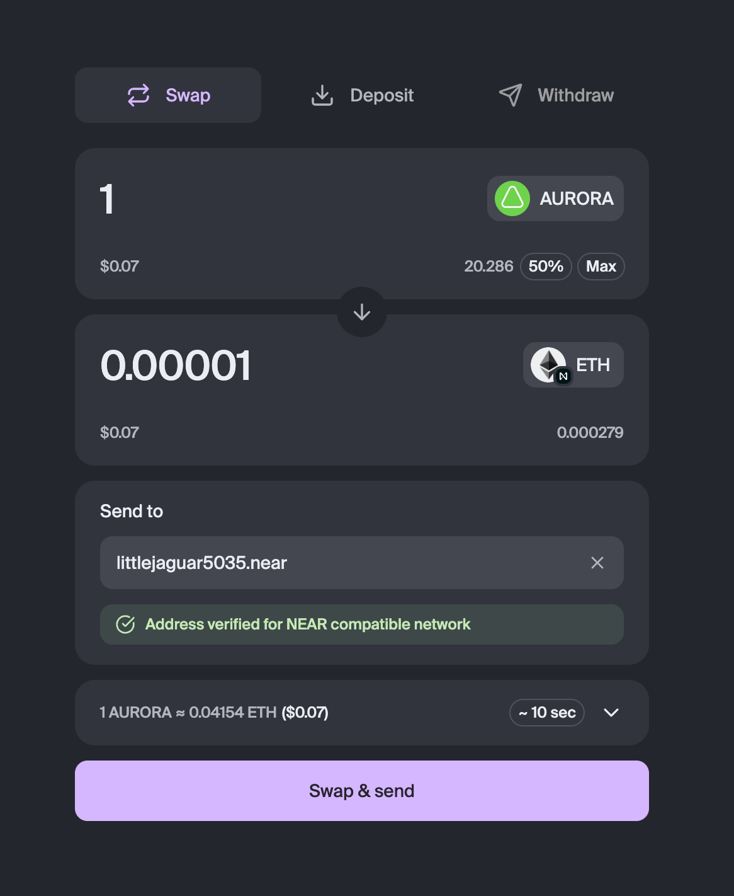

# Intents Swap Widget

Swap Widget frontend that uses [1Click API](https://docs.near-intents.org/near-intents/integration/distribution-channels/1click-api).



## Package structure

### Components

> `import { Button } from '@aurora-is-near/intents-swap-widget/component'`

_Components_ submodule exports low-level, stateless components such as buttons, inputs, and banners. These components are not connected to the widget's logic and can be considered part of an internal UI kit.

### Features

> `import { SwapQuote } from '@aurora-is-near/intents-swap-widget/features'`

_Features_ submodule exports rich components that use the widget's context to operate.

### Hooks

> `import { useTokens } from '@aurora-is-near/intents-swap-widget/hooks'`

The _Hooks_ submodule is similar to _Features_ but without the representational (UI) part. Most hooks use the widget's context, but not necessarily all of them.

### Machine

> `import { useSafeSnapshot } from '@aurora-is-near/intents-swap-widget/machine'`

_Machine_ submodule defines the finite state machine and context store. It is the heart of the business logic and, together with the Hooks, can be used to build your own UI without relying on the provided _Features_ and _Components_.

### Types

> `import type { Token } from '@aurora-is-near/intents-swap-widget/types'`

_Types_ submodule exports domain types such as `Token`, `Chain`, `Quote` etc.

## Ext

> `import { useAlchemyBalanceIntegration } from '@aurora-is-near/intents-swap-widget/ext'`

_Ext_ submodule contains various extensions that can be used with the widget but are completely optional. For example, it includes an Alchemy API integration that allows you to easily get token balances. Essentially, these are pre-written pieces of custom code.

## Theming

This package uses Tailwind, but your app doesn't have to. It exposes CSS variables to control styling. Each variable and its corresponding Tailwind token uses the `sw-` prefix to avoid conflicts with your app's theme and variables.

Here is the full list of exposed CSS files:

- `theme.css` - contains a list of CSS variables with predefined default theme values
- `theme-text.css` - contains text classes to style typography only
- `theme-classes.css` - contains utility classes that use theme variables
(e.g. `bg-sw-gray-100`, `gap-sw-xs`, `text-mauve-900` etc.)
- `styles.css` - a complete CSS file that includes all of the above plus all Tailwind utility classes used by the widget

To adjust theme, override CSS variables on your app's side (full list of defined
variable you can find in `src/theme.css` or `dist/theme.css`):

```css
:root {
    /* colors */
    --sw-success-100: #0f0;
    ...

    /* spaces */
    --sw-space-xs: 2px;
    ...

    /* texts */
    .text-sw-label-s {
        ...
    }
}
```

### Your app uses Tailwind

If your app uses Tailwind, you just need to load the theme variables, theme utility classes, and text styles. In your app's CSS file:

```css
@import 'tailwindcss';

@import '@aurora-is-near/intents-swap-widget/theme.css';
@import '@aurora-is-near/intents-swap-widget/theme-text.css';
@import '@aurora-is-near/intents-swap-widget/theme-classes.css';

@theme { ... your app's theme here ... }
```

### Your app doesn't use Tailwind

Load the complete set of CSS styles used by the widget. You can still override variables and text classes in your app to control the theme.

```css
@import '@aurora-is-near/intents-swap-widget/styles.css';
```

## Development

If you want to make changes to the package and submit PRs, here's how you can link the package to your application locally. This allows you to make changes to the package and see the results in your app:

```bash

# in a package repo
yarn link
yarn build:watch

# in your app
yarn link @aurora-is-near/intents-swap-widget
yarn dev
```

### Contribution

We use semantic release with commitlint. While creating a PR make sure it's
title meets the [requirements](https://github.com/semantic-release/semantic-release?tab=readme-ov-file#how-does-it-work)
as well as commit [messages](https://github.com/conventional-changelog/commitlint).
