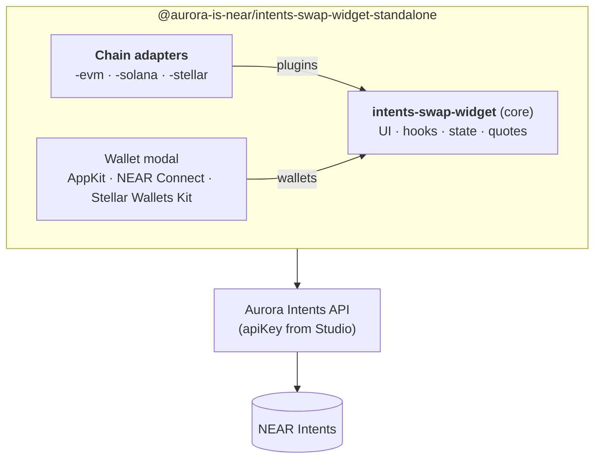

# Aurora Intents Widgets

<a href="https://studio.aurora.dev/"></a>
<a href="https://docs.intents.aurora.dev/"></a>
<a href="./LICENSE"></a>

The monorepo for the **Intents Swap Widget**, a React widget for cross-chain swaps across **35+ chains** powered by [NEAR Intents](https://docs.near-intents.org/), plus its chain adapters and the **Intents Connect** SDK.

<p align="center">
  
</p>

> [!TIP]
> **Integrating the swap widget?** Start with the **[Swap Widget README](./packages/intents-swap-widget)**. It covers Studio, integration options, config and how swaps work.

## Packages

### Swap widget

| Package | What it is | Install when |
|---|---|---|
| [`@aurora-is-near/intents-swap-widget`](./packages/intents-swap-widget) | **Core**: widget UI, hooks, state machine, components | Your app already connects wallets |
| [`@aurora-is-near/intents-swap-widget-standalone`](./packages/intents-swap-widget-standalone) | Core **+ built-in wallet connection** (AppKit, NEAR Connect, Stellar Wallets Kit) | You want the fastest integration |
| [`@aurora-is-near/intents-swap-widget-evm`](./packages/intents-swap-widget-evm) | EVM chain adapter (deposit transfers) | Core + EVM wallets |
| [`@aurora-is-near/intents-swap-widget-solana`](./packages/intents-swap-widget-solana) | Solana chain adapter | Core + Solana wallets |
| [`@aurora-is-near/intents-swap-widget-stellar`](./packages/intents-swap-widget-stellar) | Stellar chain adapter (+ balances) | Core + Stellar wallets |

### Intents Connect

| Package | What it is |
|---|---|
| [`@aurora-is-near/intents-connect`](./packages/intents-connect) | Headless client for the Intents Connect execution API: bridge from any chain, then run contract calls on the destination. Optional React bindings |
| [`@aurora-is-near/intents-connect-wallet`](./packages/intents-connect-wallet) | Chain wallets for Intents Connect: deposit transfers and connection, one subpath per chain |

## How the swap packages fit together


```mermaid
flowchart TB
    subgraph SA ["@aurora-is-near/intents-swap-widget-standalone"]
      direction LR
      AD["<b>Chain adapters</b><br/>-evm · -solana · -stellar"] -- plugins --> CORE["<b>intents-swap-widget</b> (core)<br/>UI · hooks · state · quotes"]
      MODAL["Wallet modal<br/>AppKit · NEAR Connect · Stellar Wallets Kit"] -- wallets --> CORE
    end

    SA --> API["Aurora Intents API<br/>(apiKey from Studio)"]
    API --> NI[(NEAR Intents)]
```

- **Use the whole box** (`-standalone`) for wallets out of the box, **or pick the pieces inside it**: core + the adapters you need + your own wallet connection.
- **Core** runs the swap flow for all chains: quote, deposit, status. NEAR support is built in.
- **Adapters** only send the source-chain deposit transaction. Install one per wallet family you connect.
- **No code?** Embed an iframe from [Widget Studio](https://studio.aurora.dev/). It talks to the same API.
- Every integration needs an **API key** from Studio. Fees are configured on that key.

## Documentation

| Topic | Link |
|---|---|
| Product overview | [What is Swap Widget?](https://docs.intents.aurora.dev/intents-swap/what-is-swap-widget) |
| Integrate with Studio (iframe or React) | [Widget integration](https://docs.intents.aurora.dev/intents-swap/widget-integration) |
| All config options | [Widget Configuration](https://docs.intents.aurora.dev/intents-swap/widget-configuration/get-started) (in repo: [`docs/configuration.md`](./docs/configuration.md)) |
| Wallets, theming, localisation, troubleshooting | [Wallet Connection](https://docs.intents.aurora.dev/intents-swap/widget-configuration/wallet-connection) · [Theming](https://docs.intents.aurora.dev/intents-swap/widget-configuration/theming) · [Localisation](https://docs.intents.aurora.dev/intents-swap/widget-configuration/localisation) · [Troubleshooting](https://docs.intents.aurora.dev/intents-swap/widget-configuration/troubleshooting) |
| What can be swapped | [Supported chains](https://docs.intents.aurora.dev/intents-swap/supported-chains) · [Supported assets](https://docs.intents.aurora.dev/intents-swap/supported-assets) |
| Privacy | [Confidential swaps](https://docs.intents.aurora.dev/intents-swap/confidential-swaps) |
| API keys, fee split, reports | [API Keys & Fees](https://docs.intents.aurora.dev/getting-started/api-keys-and-fees) |
| Swap API (no widget) | [Swap API Reference](https://docs.intents.aurora.dev/api-reference/swap-api-reference) |

> [!NOTE]
> **For AI agents:** [`llms.txt`](https://docs.intents.aurora.dev/llms.txt) indexes all the docs. Add `.md` to any docs URL to get Markdown, or `?ask=<question>` to query it. The source of truth for config is the `WidgetConfig` type in [`packages/intents-swap-widget/src/types/config.ts`](./packages/intents-swap-widget/src/types/config.ts). `yarn check-docs` checks that `docs/configuration.md` documents every key.

## Development

**Requirements:** Node `>=20.18.1`, Yarn 1 (workspaces), [Turborepo](https://turbo.build/).

```bash
yarn install
yarn dev
```

| Script | Does |
|---|---|
| `yarn build` | Build all packages |
| `yarn dev` | Start the dev servers |
| `yarn lint` | ESLint across the workspace |
| `yarn typecheck` | `tsc --noEmit` for every package |
| `yarn test` | Unit tests |
| `yarn check-docs` | Check that `docs/configuration.md` covers every `WidgetConfig` key |

### Using a local build in your app

```bash
# in this repo
cd packages/intents-swap-widget
yarn link
yarn build:watch

# in your app
yarn link @aurora-is-near/intents-swap-widget
yarn dev
```

### Contributing

We use [semantic-release](https://github.com/semantic-release/semantic-release?tab=readme-ov-file#how-does-it-work) with [commitlint](https://github.com/conventional-changelog/commitlint). PR titles and commit messages must follow [Conventional Commits](https://www.conventionalcommits.org/) (`feat: …`, `fix: …`). All packages are versioned and released together.

## License

[MIT](./LICENSE)
