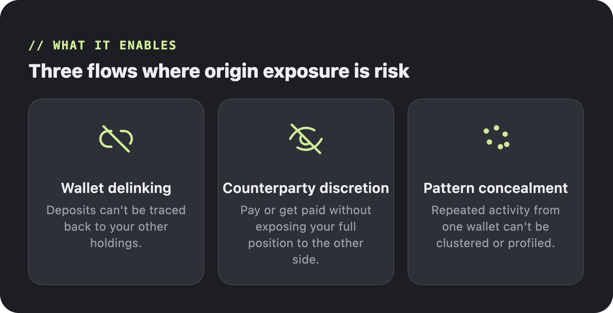

# Confidential Intents

### Confidential Intents

Every cross-chain swap normally leaves a trail. The origin wallet, the route, the size. That is your user's strategy, out in the open for anyone to read.

Confidential Intents hides it. It is live now on the Swap API.

#### Overview

A normal cross-chain swap is fully traceable. The origin wallet, the amount, and the full routing path are visible on-chain. Anyone observing can link the source wallet to the destination, map a treasury, or track a strategy as it executes.

Confidential Intents removes that link. The swap is routed through a private shard of NEAR, so the origin wallet and the routing trail are not visible to the outside world. The swap still settles on the destination chain as a standard public transaction. What is hidden is how the funds got there, not that they arrived.

#### What is hidden and what stays public

Confidentiality applies to the origin and the route only. Destination settlement remains fully public and verifiable.

| Hidden                              | Public                             |
| ----------------------------------- | ---------------------------------- |
| Origin wallet address               | Destination transaction            |
| Routing path across chains          | Destination asset and amount       |
| Link between source and destination | Recipient on the destination chain |

This scope is exact. Confidential Intents is not private DeFi and does not obscure the destination. Settlement stays auditable, so the receiving side can verify the transaction as normal.

#### How it works

<figure><figcaption></figcaption></figure>

The swap is routed through a private shard of NEAR running the NEAR Intents engine. Any swap or transfer that happens inside the private shard is not visible to the outside world.

Funds enter from the origin chain, execute within the private shard, and settle on the destination chain. Because the routing happens inside the shard, the origin chain and the destination chain are not linkable on-chain. The origin wallet is not exposed to the destination, and the intermediate routing cannot be traced back to the source.

Destination settlement is a standard on-chain transaction. No special handling is required on the receiving side. From the destination's perspective, a confidential swap and a normal swap look the same once settled.

#### What it enables

<figure><figcaption></figcaption></figure>

Confidential Intents is built for flows where exposing the origin and route creates risk.

**Position privacy**. Funds can move into a position without broadcasting the originating wallet, so the strategy behind the trade is not readable on-chain.

**Treasury protection**. Institutions can execute cross-chain without telegraphing treasury movements to anyone watching the source wallet.

#### Availability

Confidential Intents is live on the **Swap API** now. The best part is that it is a single flag on the quote endpoint you already call. No new integration. No separate API. Flip one parameter and you are live.

This is rolling out across the full suite:&#x20;

* **confidential swaps**
* **confidential deposits**
* **confidential DeFi actions.**&#x20;

Confidentiality is becoming a standard capability across Aurora Intents, available as an upgrade to the products you already integrate.

#### Enabling it

Confidential mode is a flag on the quote endpoint you already use. See the [confidential-swaps.md](intents-swap/confidential-swaps.md "mention") to get started.
