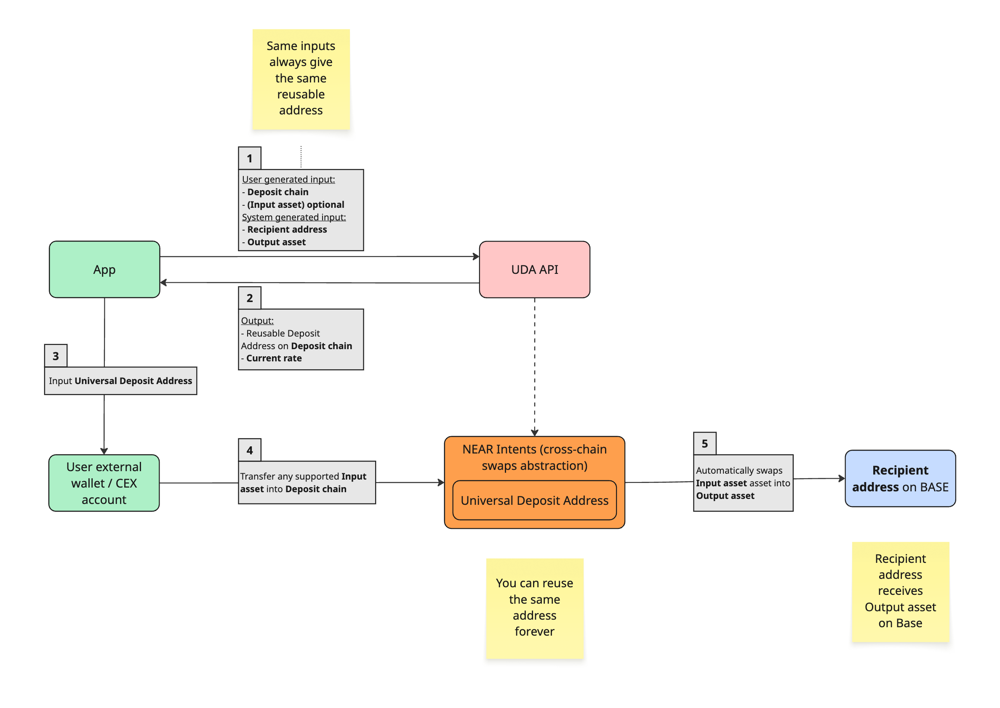

# Universal Deposit Addresses


**Pre-release** — Details are subject to change as the architecture is finalised.


A UDA is a deterministic, chain-specific address derived from a fixed set of inputs: user identifier, source chain, recipient address, and output asset. Given the same inputs, the API always returns the same address. There is no expiry, no regeneration, and no per-transaction state to manage.


The UDA is unique per chain and supports multiple asset deposits.


## Business Flow

When your app calls the UDA (Universal Deposit Address) API, it receives a reusable deposit address tied to a specific source chain and destination. The user sends a regular token transfer to that address — no bridging UI, no extra steps. The system detects the deposit, routes it through NEAR Intents, executes any required swap, and funds the destination.

<figure><figcaption></figcaption></figure>



### App requests a deposit address

Apps call the UDA API with the minimal parameters: deposit chain, recipient and output asset.



### Receive a reusable address

The UDA API returns a reusable Deposit Address along with the current exchange rates.



### User sends funds

User transfers tokens to the Deposit Address.



### System processes the transfer

NEAR Intents swap agent handles routing and processes the transaction.



### Recipient gets funds

The destination asset is delivered to the recipient on the destination chain.



## Features

### Static address

Each address is permanent and reusable. There is no TTL, no session, and no requirement to re-generate between deposits. The same address accepts unlimited sequential deposits.

### Asset conversion

An optional output asset can be specified at address generation time. If the deposited asset differs from the output asset, a swap is executed in the same atomic flow via NEAR Intents solvers. Example: `USDT on Tron → USDC on Base`.

### Destination action

You define what happens on arrival: credit a balance, execute a contract call, or fund a position. The destination action is encoded at generation time and does not require a separate call.

## Use Cases

### Neobank & fintech top-up

Give every user a persistent top-up address. They can send from any chain or CEX, and the funds are automatically added to their balance. No bridging instructions, no wrong-chain support tickets.

```
Example: SOL on Solana → routed → Neobank account credited in USDC on Base
```

### Prediction market funding

Users with assets on any chain can fund positions directly: no redirect, no bridge UI, no chain-switching prompt in the middle of a flow.

```
Example: USDT on Arbitrum → routed → prediction market account balance credited
```

### Trading account deposit

A persistent deposit address means capital flows from any chain or CEX directly into a trading account: no manual bridging, no network selection, no drop-off between decision and execution.

### Infrastructure & protocol inbound liquidity

Handle deposits from any chain natively without maintaining per-chain connectors. Embed one address generation call and let the routing layer handle the rest.
