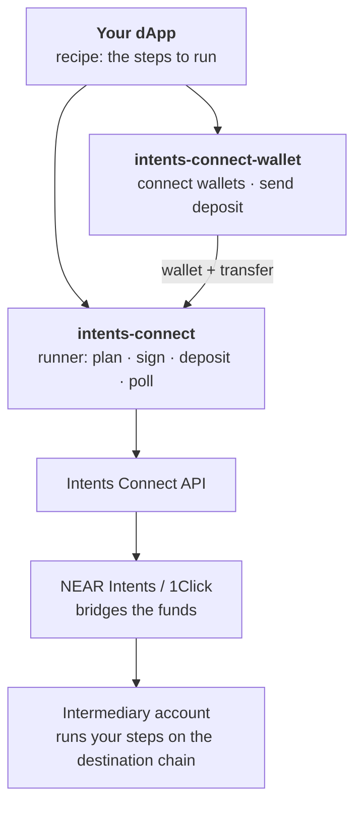

# Intents Connect SDK

> **Beta.** The SDK talks to `https://intents-connect-alpha-api.aurora.dev`. APIs may change between minor versions. TON (`ton_connect`) and Tron (`tip191`) wallets are not supported yet.

The SDK turns the [Intents Connect API](https://docs.intents.aurora.dev/api-reference/intents-connect-api-reference) into a single call. **A new integration is just a step builder**: you describe the on-chain calls to run on the destination chain, and the SDK handles everything else:

- intermediary account resolution
- quoting and fee arithmetic
- wallet signing (EVM, Solana, NEAR, Stellar)
- the deposit transfer
- polling, expiry and in-flight recovery

## Packages

| Package | What it is | Docs |
|---|---|---|
| [`@aurora-is-near/intents-connect`](https://www.npmjs.com/package/@aurora-is-near/intents-connect) | Headless TypeScript client and execution runner, with optional React bindings | [TypeScript SDK](typescript-sdk/README.md) |
| [`@aurora-is-near/intents-connect-wallet`](https://www.npmjs.com/package/@aurora-is-near/intents-connect-wallet) | Wallet connection and deposit transfers, one subpath per chain | [Wallet integrations](wallet-integrations.md) |

## How it fits together

The user signs once from their own wallet, on any supported chain. An [intermediary account](https://docs.intents.aurora.dev/intents-connect/deep-dive/intermediary-accounts) on the destination chain, controlled by that wallet, executes the steps.

## Where to start

| I want to… | Read |
|---|---|
| Understand the SDK and run my first execution | [TypeScript SDK](typescript-sdk/README.md) |
| Describe on-chain steps and choose a fee strategy | [Recipes & fees](typescript-sdk/recipes-and-fees.md) |
| Handle statuses, errors, retries and resume | [Lifecycle & errors](typescript-sdk/lifecycle-and-errors.md) |
| Use it from React | [React](typescript-sdk/react.md) |
| Connect EVM, Solana, NEAR or Stellar wallets | [Wallet integrations](wallet-integrations.md) |
| See complete integrations (Hydrex, Polymarket, Jupiter) | [Examples](examples/README.md) |

## Related

- [What is Intents Connect?](https://docs.intents.aurora.dev/intents-connect/readme-1): the product
- [How It Works](https://docs.intents.aurora.dev/intents-connect/deep-dive/how-it-works) and [Execution Lifecycle](https://docs.intents.aurora.dev/intents-connect/deep-dive/execution-lifecycle): concepts behind the SDK
- [Intents Connect API Reference](https://docs.intents.aurora.dev/api-reference/intents-connect-api-reference): the HTTP API the SDK calls
- [Source on GitHub](https://github.com/aurora-is-near/intents-swap-widget/tree/main/packages/intents-connect)
