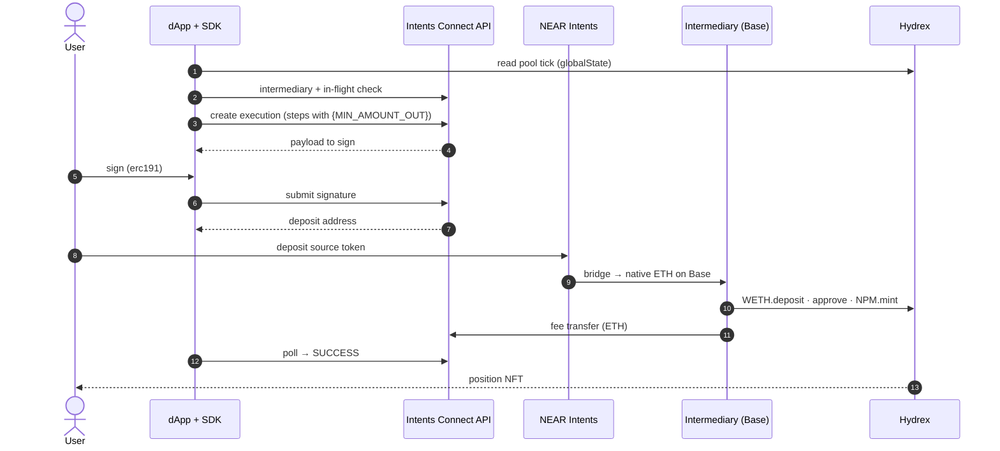

# Hydrex

> **Beta.** Part of [Examples](README.md).

**A user on any chain opens a concentrated-liquidity position in Hydrex's cbETH/WETH pool on Base.** The position NFT lands in their own wallet. They don't need ETH on Base or a bridge.

## At a glance

| | |
|---|---|
| **Destination** | Base |
| **Protocol** | Hydrex: cbETH/WETH pool `0xB1383DC4…6e97`, position manager (NPM) `0xC63E9672…Ab86` |
| **Bridged asset** | Native ETH on Base (`nep141:base.omft.near`) |
| **Output** | A position NFT minted to the **user's wallet**. The position holds WETH only |
| **Flow / fee** | `bridge-in` · placeholder (EVM default) · fee paid in ETH |
| **Source** | [`hydrex/constants.ts`](https://github.com/aurora-is-near/intents-swap-widget/blob/main/apps/intents-connect-demo/src/hydrex/constants.ts) · [`hydrex/plan.ts`](https://github.com/aurora-is-near/intents-swap-widget/blob/main/apps/intents-connect-demo/src/hydrex/plan.ts) |

## What the user does

1. **Connects** an EVM wallet.
2. **Picks** a source token and amount on any supported chain.
3. **Chooses** how to pay: *send from connected wallet*, or deposit to an address or QR code.
4. **Clicks** *Deposit into cbETH/WETH* and **signs** the Intents Connect message.
5. **Approves** the transfer in the wallet (or sends to the QR address).
6. **Sees** the status move to success, and the new position appear in the positions list.

There are no range inputs: the dApp picks the price range automatically.

## How it works



1. **Pick the range.** The dApp reads the pool's current tick and sets `tickUpper = tick − 2` and `tickLower = tickUpper − 100`. The range sits *below* the price, so the position needs WETH only, and WETH is all the bridge delivers.
2. **Preflight.** The SDK resolves the user's Base intermediary and checks that no other execution is in flight.
3. **Plan.** `buildSteps` runs with `amount = '{MIN_AMOUNT_OUT}'` (placeholder strategy), so one create call is enough.
4. **Create.** The execution is created with three steps. The destination is native ETH, so the destination-token rule doesn't apply.
5. **Sign.** The user signs the payload with their EVM wallet (`erc191`).
6. **Deposit.** After the signature, the deposit address appears. The wallet transfer (or the user's own transfer) sends the source token there.
7. **Bridge.** NEAR Intents / 1Click delivers native ETH to the intermediary on Base.
8. **Execute.** The intermediary runs `WETH.deposit()` (wraps the ETH), `WETH.approve(NPM)` and `NPM.mint(...)`, with `recipient = userAddress`. The service then appends its fee transfer in ETH.
9. **Settle.** The SDK polls until `SUCCESS`. The NFT is already in the user's wallet, and nothing stays in the intermediary.

> The demo sets slippage minimums to `0` in `mint`. Set real minimums in production.

## Core code

**Recipe:** the three on-chain steps.

```ts
const hydrexMintRecipe: Recipe<{ tickLower: string; tickUpper: string }> = {
  id: 'hydrex-manual-mint',
  intent: 'hydrex_manual_mint',
  title: 'Hydrex cbETH/WETH position',
  flow: 'bridge-in',
  type: 'evm',
  destination: { chain: 'base', assetId: 'nep141:base.omft.near' }, // native ETH
  buildSteps: ({ userAddress, amount }, { tickLower, tickUpper }) => [
    { to: WETH, functionSignature: 'deposit()', parameters: [], value: amount },
    { to: WETH, functionSignature: 'approve(address,uint256)', parameters: [NPM, amount], value: '0' },
    {
      to: NPM,
      functionSignature:
        'mint((address,address,address,int24,int24,uint256,uint256,uint256,uint256,address,uint256))',
      parameters: [[CBETH, WETH, ZERO, tickLower, tickUpper, '0', amount, '0', '0', userAddress, deadline]],
      value: '0',
    },
  ],
};
```

**Plan and run:**

```ts
const [, tick] = await base.readContract({ address: POOL, abi: POOL_ABI, functionName: 'globalState' });
const tickUpper = Number(tick) - 2;

await exec.run({
  recipe: hydrexMintRecipe,
  params: { tickLower: String(tickUpper - 100), tickUpper: String(tickUpper) },
  quote: {
    originAsset: token.assetId,
    destinationAsset: 'nep141:base.omft.near',
    amount: amountAtomic,
    swapType: 'EXACT_INPUT',
    slippageTolerance: 100,
  },
  originChain: token.blockchain,
  originToken: { contractAddress: token.contractAddress, decimals: token.decimals },
  depositViaWallet,
});
```

## Related

- [Recipes & fees](../typescript-sdk/recipes-and-fees.md): placeholders and the placeholder strategy
- [Polymarket](polymarket.md): the same flow with a token destination
