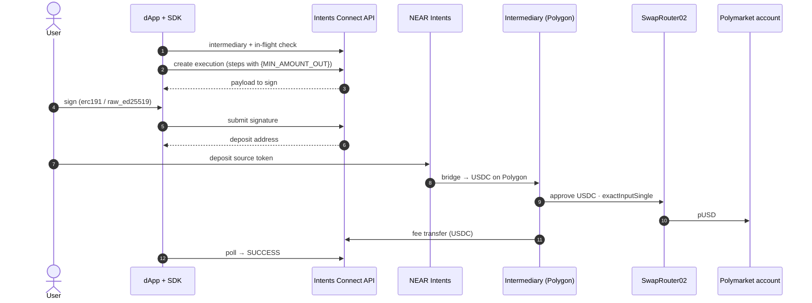

# Polymarket

> **Beta.** Part of [Examples](README.md).

**A user on any chain tops up their Polymarket account.** Their funds become pUSD on Polygon, paid straight into the Polymarket account (a proxy contract), ready to trade. They don't need MATIC, a bridge or a Polygon wallet.

## At a glance

| | |
|---|---|
| **Destination** | Polygon |
| **Protocol** | Uniswap SwapRouter02 `0x68b34658…Fc45`: USDC → pUSD (`0xC011a7E1…2DFB`), 0.01% pool |
| **Bridged asset** | Native Polygon USDC `0x3c499c…3359` (`nep245:v2_1.omni.hot.tg:137_qiSt…L`) |
| **Output** | pUSD in the **user's Polymarket account** (not the signing wallet) |
| **Flow / fee** | `bridge-in` · placeholder (EVM default) · fee paid in USDC |
| **Source** | [`polymarket/constants.ts`](https://github.com/aurora-is-near/intents-swap-widget/blob/main/apps/intents-connect-demo/src/polymarket/constants.ts) · [`polymarket/plan.ts`](https://github.com/aurora-is-near/intents-swap-widget/blob/main/apps/intents-connect-demo/src/polymarket/plan.ts) |

## What the user does

1. **Connects** a wallet (EVM or Solana).
2. **Pastes** their Polymarket account address. On polymarket.com, hover the account icon to find it. The button stays disabled until the address is valid.
3. **Picks** a source token and amount, and chooses to send from the wallet or deposit via QR.
4. **Clicks** *Deposit to Polymarket*, **signs**, and **approves** the transfer.
5. **Sees** the account's pUSD balance update on success.

## How it works



1. **Preflight.** The SDK resolves the user's Polygon intermediary and checks that no other execution is in flight.
2. **Plan.** `buildSteps` runs with `amount = '{MIN_AMOUNT_OUT}'`. The Polymarket account goes in **`params`**, because the SDK rejects `quote.recipient` on a bridge-in.
3. **Create.** Two steps. The destination is a token, so a step must call USDC: the `approve` does.
4. **Sign.** The origin wallet signs: `erc191` for EVM, `raw_ed25519` for Solana.
5. **Deposit.** The deposit address appears after signing, and the source token is sent there.
6. **Bridge.** NEAR Intents / 1Click delivers native USDC to the intermediary on Polygon.
7. **Execute.** The intermediary approves SwapRouter02, then calls `exactInputSingle(USDC → pUSD)` with `recipient = Polymarket account`. The service then appends its fee transfer in USDC.
8. **Settle.** The SDK polls until `SUCCESS`. The pUSD is already in the Polymarket account.

**Why pay the account inside the swap?** Under the placeholder strategy, the swap's output amount can't be known in advance, so a separate "transfer pUSD" step couldn't name an amount. Paying the recipient directly also leaves no dust in the intermediary.

> The demo sets `amountOutMinimum = 0`. Set a real minimum in production.

## Core code

**Recipe:** approve, then swap to the user's account.

```ts
const polymarketDepositRecipe: Recipe<{ account: string }> = {
  id: 'polymarket-deposit',
  intent: 'polymarket_deposit',
  title: 'Polymarket deposit',
  flow: 'bridge-in',
  type: 'evm',
  destination: { chain: 'pol', assetId: POL_USDC_ASSET, tokenAddress: USDC },
  buildSteps: ({ amount }, { account }) => [
    { to: USDC, functionSignature: 'approve(address,uint256)', parameters: [SWAP_ROUTER, amount], value: '0' },
    {
      to: SWAP_ROUTER,
      functionSignature: 'exactInputSingle((address,address,uint24,address,uint256,uint256,uint160))',
      parameters: [[USDC, PUSD, '100', account, amount, '0', '0']], // recipient = Polymarket account
      value: '0',
    },
  ],
};
```

**Plan and run:**

```ts
await exec.run({
  recipe: polymarketDepositRecipe,
  params: { account }, // never quote.recipient on a bridge-in
  quote: {
    originAsset: token.assetId,
    destinationAsset: POL_USDC_ASSET,
    amount: amountAtomic,
    swapType: 'EXACT_INPUT',
    slippageTolerance: 100,
  },
  originChain: token.blockchain,
  originToken: { contractAddress: token.contractAddress, decimals: token.decimals },
  depositViaWallet,
});
```

## Related

- [Recipes & fees](../typescript-sdk/recipes-and-fees.md#rules-and-limits): the destination-token and recipient rules
- [Hydrex](hydrex.md): the same flow with a native destination
