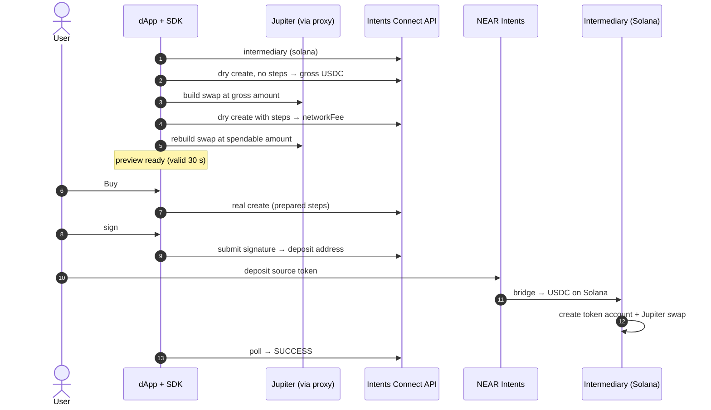

# Solana (Jupiter)

> **Beta.** Part of [Examples](README.md).

**A user on any chain buys a Solana token that 1Click doesn't list**: JitoSOL, BNSOL, JUP, JLP, RENDER, BP, JupSOL, USDe, PYTH or RAY. Their funds are bridged to USDC on Solana, then swapped on Jupiter by their **Solana intermediary account**, where the tokens stay. Later they can **sell** them back to USDC or **withdraw** USDC to any Solana wallet.

## At a glance

| | |
|---|---|
| **Destination** | Solana |
| **Protocol** | Jupiter v6 swap (`JUP6Lkb…aV4`), built through the Jupiter Swap API |
| **Bridged asset** | USDC on Solana (`EPjF…Dt1v`) |
| **Output** | The bought token, in the **user's Solana intermediary** |
| **Flow / fee** | Buy: `bridge-in` · `threeRound` (0.25% reserve) · fee in USDC. Sell and withdraw: `steps-only` |
| **Slippage budget** | 1% total: 0.25% bridge, 0.25% reserve, 0.5% Jupiter |
| **Server** | A proxy keeps `JUPITER_API_KEY` off the client. A read-only RPC proxy handles balance reads |
| **Source** | [`solana/plan.ts`](https://github.com/aurora-is-near/intents-swap-widget/blob/main/apps/intents-connect-demo/src/solana/plan.ts) · [`solana/jupiter.ts`](https://github.com/aurora-is-near/intents-swap-widget/blob/main/apps/intents-connect-demo/src/solana/jupiter.ts) · [`solana/withdraw.ts`](https://github.com/aurora-is-near/intents-swap-widget/blob/main/apps/intents-connect-demo/src/solana/withdraw.ts) · [`solanaProxy.ts`](https://github.com/aurora-is-near/intents-swap-widget/blob/main/apps/intents-connect-demo/solanaProxy.ts) |

## What the user does

1. **Connects** an EVM or Solana wallet and **picks** a source token and amount.
2. **Picks** the token to buy.
3. **Clicks** *Get quote* and sees the estimated and minimum purchase, the network fee in USDC, and the Jupiter route. The quote is valid for 30 s.
4. **Clicks** *Buy*. The quote is refreshed. If the minimum dropped, they're warned and must confirm again.
5. **Signs** and **deposits**, then sees the execution id and a Solana explorer link.
6. **Manages** holdings under *Your Solana assets*: **Sell** a token back to USDC, or **Withdraw** USDC to a Solana address.

## How it works (buy)



1. **Intermediary.** The SDK resolves the user's Solana intermediary. It is both the Jupiter `taker` and the owner of the output token account.
2. **Preview, round 1.** A dry create with no steps gives the gross USDC that will reach the intermediary.
3. **Preview, round 2.** The dApp builds a Jupiter swap for that amount (through its proxy) and validates it:
   - it must be Jupiter v6;
   - only the intermediary may sign;
   - the input and output accounts must be the intermediary's.

   A second dry create then measures the network fee.
4. **Preview, round 3.** `spendable = (gross − fee) × (1 − 0.25%)`. The swap is rebuilt at exactly that amount. `prepareSolanaSteps` swaps the intermediary pubkey for a placeholder and drops compute-budget instructions.
5. **Confirm.** The user clicks *Buy*. The dApp re-previews, and if the minimum dropped, asks again. Then `run(preview.plan)` creates the real execution with the **frozen** steps. If the quote got worse, it throws `QUOTE_MOVED` before signing.
6. **Sign.** The origin wallet signs: `erc191` for EVM, `raw_ed25519` for Solana.
7. **Deposit.** The source token goes to the deposit address, from the wallet or via QR.
8. **Bridge.** NEAR Intents / 1Click delivers USDC to the intermediary.
9. **Execute.** Connect's relayer adds its own payer, durable nonce and compute budget. The intermediary creates the output token account if needed and runs the Jupiter swap. The fee is paid in USDC.
10. **Settle.** The SDK polls until `SUCCESS`. The tokens are in the intermediary's token account. Leftover USDC from the reserve and slippage stays there too.

## Getting funds out (steps-only)

The tokens live in the intermediary, so leaving is a **steps-only** execution: no bridge and no deposit, just a signature.

| Action | Steps | Fee |
|---|---|---|
| **Sell** | Jupiter swap of the whole token balance → USDC, inside the intermediary | From the USDC produced, capped by `maxNetworkFee` |
| **Withdraw** | Create the recipient's USDC account, then `transferChecked` USDC out | From the amount spent (`feeFromAmount`), so it sends `balance − fee` |

Both run `previewSteps(plan)` → show fee → `runSteps(preview.plan)`. A `503` means no Solana durable-nonce account was free: retry shortly.

## Core code

**Buy recipe:** the steps are a Jupiter swap built for the exact amount.

```ts
const recipe: SolanaRecipe<{ outputMint: string }> = {
  id: `solana-buy-${symbol}`,
  intent: `solana_buy_${symbol}`,
  title: `Buy ${symbol} into your Connect account`,
  type: 'solana',
  flow: 'bridge-in',
  destination: { chain: 'sol', assetId: SOLANA_USDC.assetId, tokenAddress: SOLANA_USDC.mint },
  buildSteps: async ({ intermediary, amount }) =>
    (await buildJupiterSwap({ intermediary, amount, input: SOLANA_USDC, output })).prepared,
};
```

**Inside `buildJupiterSwap`:** the swap is built for the intermediary, then prepared.

```ts
const build = await fetch(`${JUPITER_BUILD_URL}?${new URLSearchParams({
  inputMint: USDC_MINT, outputMint, amount,
  taker: intermediary, destinationTokenAccount: intermediaryOutputAta,
  slippageBps: '50', wrapAndUnwrapSol: 'false', maxAccounts: '24',
})}`).then((r) => r.json());

return prepareSolanaSteps(validatedInstructions, { intermediary, addressLookupTables });
```

**Preview, then commit:**

```ts
const preview = await exec.preview({
  recipe,
  params: { outputMint },
  feeStrategy: { kind: 'threeRound', amountReserveBps: 25 },
  quote: {
    originAsset: token.assetId,
    destinationAsset: SOLANA_USDC.assetId,
    amount: amountAtomic,
    swapType: 'EXACT_INPUT',
    slippageTolerance: 25,
  },
  originChain: token.blockchain,
  originToken: { contractAddress: token.contractAddress, decimals: token.decimals },
  depositViaWallet,
});
// show preview.networkFee / preview.spendable, then commit exactly these steps:
await exec.run(preview.plan);
```

**Withdraw (steps-only):**

```ts
const preview = await exec.previewSteps({
  recipe: withdrawRecipe, // buildSteps: createSolanaRecipientAta + transferChecked
  params: { recipient },
  amount: usdcBalance,
  feeFromAmount: { amountReserveBps: 0 },
});
await exec.runSteps(preview.plan);
```

## Related

- [Recipes & fees](../typescript-sdk/recipes-and-fees.md#fee-strategies-bridge-in): `threeRound` and steps-only fees
- [Wallet integrations](../wallet-integrations.md#solana-step-helpers): `prepareSolanaSteps`, `createSolanaRecipientAta`
- [Getting your Solana intermediary address](https://docs.intents.aurora.dev/intents-connect/developer-guides/solana/getting-your-solana-intermediary-address)
