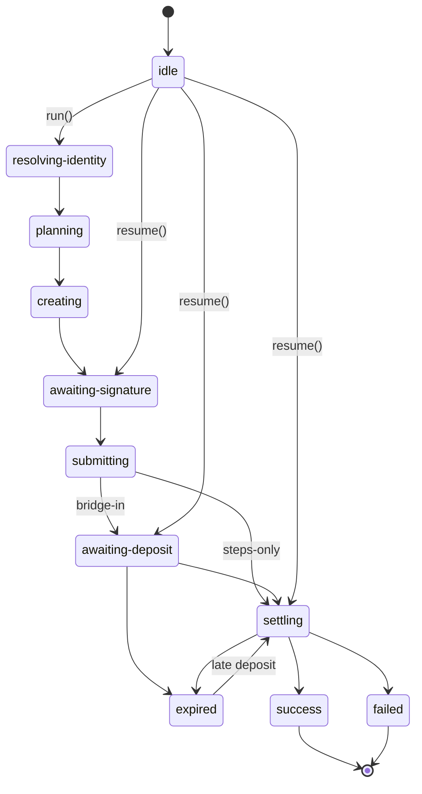

# Lifecycle & errors

> **Beta.** Part of the [TypeScript SDK](README.md).

The runner tracks two things:
- **phases**: the client-side progress, from `runner.getPhase()`
- **statuses**: the server's view of the execution, polled from the API. See [Execution Lifecycle](https://docs.intents.aurora.dev/intents-connect/deep-dive/execution-lifecycle)

## Phases



> Any in-flight phase can also move to `cancelled`. `success`, `failed` and `cancelled` are terminal. **`expired` is not**: a late deposit revives the execution.

| Phase | What's happening | Server status |
|---|---|---|
| `resolving-identity` | Fetching the user's intermediary. Checking no other execution is in flight | none |
| `planning` | Building steps and sizing the fee | none |
| `creating` | Creating the execution | `CREATED` |
| `awaiting-signature` | Waiting for the user to sign the payload | `CREATED` |
| `submitting` | Submitting the signature | `CREATED` |
| `awaiting-deposit` | Deposit address shown (never before signing). Wallet transfer or QR | `DEPOSIT_PENDING` |
| `settling` | Polling until the steps finish on the destination chain | `DEPOSIT_PROCESSING` → `OPERATION_PENDING` → `OPERATION_PROCESSING` |
| `success` | Done | `SUCCESS` |
| `failed` | Terminal failure | `DEPOSIT_FAILED` / `OPERATION_FAILED` |
| `expired` | Deposit window passed, still watching | `EXPIRED` |

The user always **signs before depositing**, so a deposit address can't be shown too early.

## Events

Pass `onEvent` to `createExecutionRunner` (or to `useExecution` in React):

| Event | Payload | Typical UI |
|---|---|---|
| `phase` | `phase` | Button label and spinner |
| `status` | `status` | Status line |
| `created` | `executionId` | Save it so you can `resume()` later |
| `quoted` | `networkFee`, `spendable` | Show the fee and the final amount (threeRound, steps-only) |
| `deposit-address` | `address`, `memo`, `deadline?` | Show the QR code and a countdown |
| `deposit-sent` | `txHash` | Explorer link |
| `error` | `error` | Error message and the recovery action |

## Errors

| Error | Meaning | What to do |
|---|---|---|
| `GuardError` (`code`) | A precondition failed, usually before anything is signed | Depends on the code (table below) |
| `DepositTransferError` | The wallet transfer failed or was rejected. The runner stays in `awaiting-deposit` | `retryDeposit()` |
| `ExecutionPollTimeoutError` | Polling budget used up (about 12 min). The execution is still live | `resume(executionId)` |
| `ExecutionCancelledError` | `cancel()` was called | Nothing, this is not a failure |
| `RunnerDisposedError` | The runner was disposed mid-flight | `resume(id)` from a new runner |
| `IntentsConnectApiError` | Non-2xx from the API (`status`, `body`) | Show the error. A 409 becomes `EXECUTION_IN_FLIGHT` |

Common guard codes:

| Code | Cause |
|---|---|
| `EXECUTION_IN_FLIGHT` | The wallet already has a live execution on this chain (one at a time). `meta.executionId` holds its id |
| `QUOTE_MOVED` | The quote got worse after `preview()`. Preview again |
| `NETWORK_MISMATCH` | The EVM wallet is on another chain than `originChainId` |
| `DESTINATION_TOKEN_UNTOUCHED` | No step calls `destination.tokenAddress` ([Recipes & fees](recipes-and-fees.md#rules-and-limits)) |
| `RECIPIENT_NOT_ALLOWED` | `quote.recipient` was set on a bridge-in |
| `MEMO_REQUIRED` | Stellar deposit without a memo |
| `NO_TRANSFER_IMPLEMENTATION` | `depositViaWallet: true`, but there's no transfer ([Wallet integrations](../wallet-integrations.md)) |
| `UNSUPPORTED_SIGNING_STANDARD` | The wallet uses `tip191` / `ton_connect` |
| `FEE_EXCEEDS_AMOUNT` | Steps-only: the fee would eat the whole amount |

## Recovery

`deriveExecutionRecovery(error)` turns an error into a next action:

```ts
import { deriveExecutionRecovery } from '@aurora-is-near/intents-connect';

const recovery = deriveExecutionRecovery(error);

if (recovery?.kind === 'resume-or-cancel') {
  // another execution holds the lock
  await runner.resume(recovery.executionId); // or runner.cancel(recovery.executionId)
}
if (recovery?.kind === 'retry-transfer') {
  await runner.retryDeposit(); // user rejected the wallet transfer
}
```

| Situation | Action |
|---|---|
| Page reloaded mid-execution | `resume(savedExecutionId)`. For a non-EVM origin across sessions, pass `{ originToken }` |
| User rejected the signature | The runner auto-cancels by default (`autoCancelOnSignatureRejection`) to free the lock |
| Deposit sent after `EXPIRED` | Keep polling: the execution revives |
| Stellar origin | Can't be cancelled client-side. It clears on expiry |

## Next

- [React](react.md): the same lifecycle as hook state
- [Handling Support Cases](https://docs.intents.aurora.dev/intents-connect/integration-best-practices/handling-support-cases) · [UX Recommendations](https://docs.intents.aurora.dev/intents-connect/integration-best-practices/ux-recommendations)
