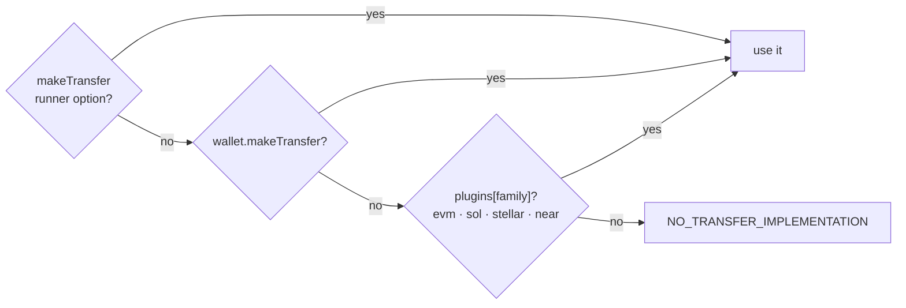

# Wallet integrations

> **Beta.** Part of the [Intents Connect SDK](README.md).

`@aurora-is-near/intents-connect-wallet` gives the [TypeScript SDK](typescript-sdk/README.md) two things:

- **Connect**: a wallet modal and connectors that produce a `WalletConnector` (address, signing standard, providers).
- **Transfer**: `makeTransfer` per chain. It sends the user's deposit to the execution's deposit address.

Every chain SDK is an **optional peer dependency** behind its own subpath, so an EVM-only app never installs Solana or Stellar code.

## Subpaths

| Subpath | Gives you | Install alongside |
|---|---|---|
| `/evm` | `evm` transfer plugin | `viem` |
| `/solana` | `sol` transfer plugin, Solana step helpers | `@solana/web3.js @solana/spl-token` |
| `/stellar` | `stellar` transfer plugin, `decodePublicKey` | `@stellar/stellar-sdk` |
| `/near` | `near` transfer plugin | none (uses `fetch`) |
| `/connect` | `WalletSelectorModal`, `useWalletSelector`, option presets | `react @headlessui/react` |
| `/connect/appkit` | EVM + Solana connectors (Reown AppKit) | `react viem @reown/appkit @reown/appkit-adapter-ethers @reown/appkit-adapter-solana @solana/wallet-adapter-phantom @solana/wallet-adapter-solflare @solana/web3.js @solana/spl-token` |
| `/connect/near` | NEAR connector (HOT, Meteor, MyNearWallet…) | `react @hot-labs/near-connect` |
| `/connect/stellar` | Stellar connector (Freighter, xBull) | `react @creit.tech/stellar-wallets-kit @stellar/stellar-sdk` |

Always install `@aurora-is-near/intents-connect` and `@aurora-is-near/intents-connect-wallet`.

## How the runner finds a transfer



A transfer is only needed when `depositViaWallet: true`. With `false`, the user deposits to the shown address from any wallet or exchange.

## Quick path: EVM + Solana

`useIntentsConnectWallet()` returns a `WalletConnector` with the transfer **already wired in**. No plugins needed. This is what the [demo](https://github.com/aurora-is-near/intents-swap-widget/tree/main/apps/intents-connect-demo) uses.

```tsx
import { IntentsConnectProvider } from '@aurora-is-near/intents-connect/react';
import { EVM_SOLANA_WALLET_OPTION, WalletSelectorModal } from '@aurora-is-near/intents-connect-wallet/connect';
import { AppKitProvider, useIntentsConnectWallet } from '@aurora-is-near/intents-connect-wallet/connect/appkit';

function Content() {
  const { wallet, family, connect } = useIntentsConnectWallet(); // family: 'evm' | 'sol' | null

  return <IntentsConnectProvider api={api} wallet={wallet}>…</IntentsConnectProvider>;
}

export const App = () => (
  <AppKitProvider appName="My dApp" themeMode="dark" projectId="YOUR_REOWN_PROJECT_ID">
    <Content />
  </AppKitProvider>
);
```

| `AppKitProvider` prop | Default |
|---|---|
| `projectId` | Aurora's shared Reown id. **Register your own for production** |
| `themeMode` | `'dark'` / `'light'` |
| `rpcOverrides` | publicnode RPCs per EVM chain id |

EVM networks: Ethereum, Arbitrum, Base, BSC, Polygon, Optimism, Avalanche, Gnosis, Berachain, Monad, Plasma, Scroll, X Layer, ADI, Aurora, plus Solana.

## Multi-chain path: EVM, Solana, NEAR, Stellar

Combine connectors with `useWalletSelector`. Only one wallet is connected at a time. These connectors don't carry a transfer, so add **plugins**.

```tsx
import { useWalletSelector, WalletSelectorModal, ALL_WALLET_OPTIONS } from '@aurora-is-near/intents-connect-wallet/connect';
import { useAppKitConnector } from '@aurora-is-near/intents-connect-wallet/connect/appkit';
import { useNearConnector } from '@aurora-is-near/intents-connect-wallet/connect/near';
import { useStellarConnector } from '@aurora-is-near/intents-connect-wallet/connect/stellar';
import { evm } from '@aurora-is-near/intents-connect-wallet/evm';
import { sol } from '@aurora-is-near/intents-connect-wallet/solana';
import { near } from '@aurora-is-near/intents-connect-wallet/near';
import { stellar } from '@aurora-is-near/intents-connect-wallet/stellar';

const nearConnector = useNearConnector();
const selector = useWalletSelector([useAppKitConnector(), nearConnector, useStellarConnector()]);
const providers = selector.providers;

<IntentsConnectProvider
  api={api}
  wallet={toWalletConnector(selector)} // adapter, see the package README
  plugins={{ evm, sol, near, stellar }}
  pluginOptions={{
    evm: { provider: providers.evm },
    sol: { provider: providers.sol },
    near: { wallet: nearConnector.wallet },
    stellar: { provider: providers.stellar },
  }}>
  …
</IntentsConnectProvider>
<WalletSelectorModal
  open={selector.isOpen} onClose={selector.close}
  options={ALL_WALLET_OPTIONS} onSelect={selector.select} />
```

The `toWalletConnector(selector)` adapter is in the [package README](https://github.com/aurora-is-near/intents-swap-widget/tree/main/packages/intents-connect-wallet#connection). Only pass the options whose connector you installed.

## Transfer plugins

Use these when you connect wallets yourself. With a single chain family, `pluginOptions` can be flat. With several, namespace them by family as shown above.

**EVM**
```ts
import { evm } from '@aurora-is-near/intents-connect-wallet/evm';

createExecutionRunner({ api, wallet, plugins: { evm }, pluginOptions: { provider: window.ethereum } });
```
- Switches the chain, or adds it (error 4902 → `wallet_addEthereumChain`).
- Sends native value or an ERC-20 `transfer`.
- On Aurora it uses `withdrawToNear`.

**Solana**: the key is `sol`
```ts
import { sol } from '@aurora-is-near/intents-connect-wallet/solana';

createExecutionRunner({ api, wallet, plugins: { sol }, pluginOptions: { provider, rpcUrl } });
```
- Sends SOL, or an SPL token with `transferChecked`.
- Creates the recipient's token account if it's missing.
- Default RPC is publicnode. Pass `rpcUrl` or `connection` for production.

**NEAR**
```ts
import { near } from '@aurora-is-near/intents-connect-wallet/near';

createExecutionRunner({ api, wallet, plugins: { near }, pluginOptions: { wallet: nearWallet } });
```
- Sends NEAR, or a NEP-141 `ft_transfer`.
- Adds a `storage_deposit` first when needed.
- `nearWallet` needs `signAndSendTransactions`, e.g. `useNearConnector().wallet`.

**Stellar**
```ts
import { stellar } from '@aurora-is-near/intents-connect-wallet/stellar';

createExecutionRunner({ api, wallet, plugins: { stellar }, pluginOptions: { provider } });
```
- Sends XLM, USDC or `CODE:ISSUER` assets, **mainnet only**.
- The deposit **memo is required** (the runner passes it). A deposit without a memo is lost.

## Solana step helpers

For [Solana recipes](typescript-sdk/recipes-and-fees.md#solana-steps). They make no network calls and don't sign anything.

```ts
import { createSolanaRecipientAta, prepareSolanaSteps } from '@aurora-is-near/intents-connect-wallet/solana';

const ata = createSolanaRecipientAta({ intermediary, recipient, mint }); // { address, instruction }
return prepareSolanaSteps([ata.instruction, ...swapInstructions], { intermediary, addressLookupTables });
```

## Next

- [TypeScript SDK](typescript-sdk/README.md) · [Examples](examples/README.md)
- [Package README](https://github.com/aurora-is-near/intents-swap-widget/tree/main/packages/intents-connect-wallet) · [npm](https://www.npmjs.com/package/@aurora-is-near/intents-connect-wallet)
