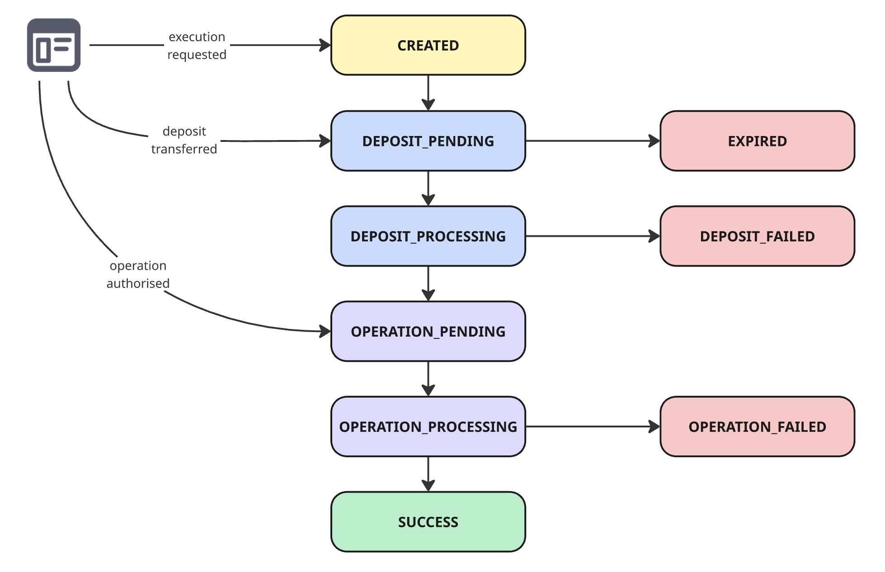
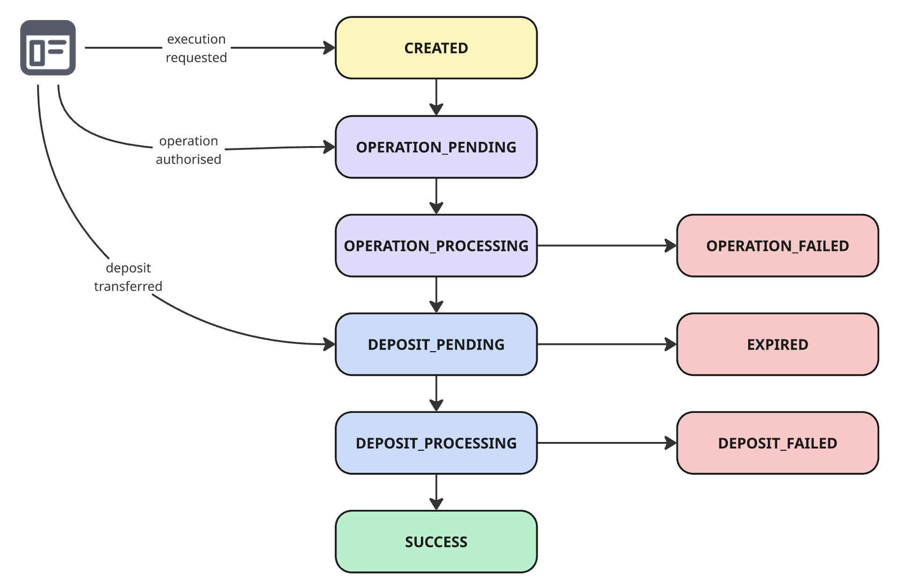
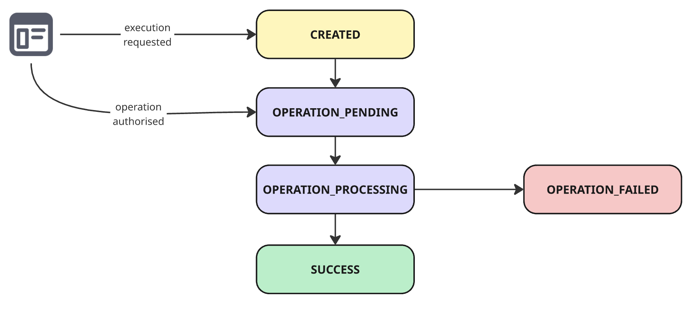

# Execution Lifecycle

An **Execution** represents a state machine that coordinates two independent phases:

1. **Deposit phase** (funds arrival and confirmation)
2. **Operation phase** (transaction execution on the destination chain)

Depending on the usage scenario, these phases may occur in reverse order.

### Core Concepts

* **Execution**: A single user intent being processed.
* **Deposit**: Movement of funds into the system (source → destination).
* **Operation**: Action performed using those funds (e.g., deposit, withdraw).
* **Intermediary account**: Account on the destination chain derived from the source account, controlled by the source private key.

Each execution progresses through a deterministic set of states. Execution state can be [requested](../intents-connect-api-reference/request-an-execution.md) and [monitored](../intents-connect-api-reference/fetch-executions.md) through an API:

* status is polled
* state is authoritative
* transitions are eventual

## States

### Active States

After creating the execution via the API, to continue the flow, instruct the user to make a deposit, authorise the operation, or both, as explained in the [Execution Scenarios](execution-lifecycle.md#execution-scenarios).

| Status                 | Description                                                                                      |
| ---------------------- | ------------------------------------------------------------------------------------------------ |
| `CREATED`              | Execution requested by integrator. Awaiting next step (deposit or operation, depending on flow). |
| `DEPOSIT_PENDING`      | Deposit transaction detected or expected but not yet confirmed.                                  |
| `DEPOSIT_PROCESSING`   | Deposit is being verified and finalised (e.g., confirmations, indexing).                         |
| `OPERATION_PENDING`    | Deposit completed. Operation is queued but not yet submitted.                                    |
| `OPERATION_PROCESSING` | Operation submitted and awaiting confirmation on the destination chain.                          |
| `SUCCESS`              | Execution completed successfully.                                                                |

* `DEPOSIT_PENDING → DEPOSIT_PROCESSING` occurs when the deposit transaction is detected on-chain.
* `DEPOSIT_PROCESSING → OPERATION_PENDING` occurs after the deposit is completed.
* `OPERATION_PENDING → OPERATION_PROCESSING` occurs when the deposit transaction is detected on-chain.
* `OPERATION_PROCESSING → SUCCESS` occurs after the on-chain transaction is successful.

### Failure States

All failure states are terminal. Recovery actions (e.g., withdrawal or retry via a new execution) must be handled explicitly by the client, because assets end up in intermediary accounts, requiring a retry or withdrawal.

It is recommended to let the user decide on the exact outcome, which may require creating a new execution.

|                    |                                                                                                                       |
| ------------------ | --------------------------------------------------------------------------------------------------------------------- |
| `EXPIRED`          | The deposit was not completed within the allowed time window specified by the execution metadata returned by the API. |
| `DEPOSIT_FAILED`   | Deposit failed or was reverted/refunded.                                                                              |
| `OPERATION_FAILED` | Operation failed after deposit completion. Recovery actions may be required (e.g. rety or withdrawal).                |

* `DEPOSIT_PENDING → EXPIRED` occurs once the deposit wasn't made in the time frame returned by the API. Transferred funds will be refunded.
* `DEPOSIT_PROCESSING → DEPOSIT_FAILED` occurs on deposit failure, such as an invalid deposit amount. Transferred funds will be refunded.
* `OPERATION_PROCESSING → OPERATION_FAILED` occurs when the destination chain transaction failed and wasn't included on the chain.

### State Machine Invariant

* Execution is **strictly linear within each phase** (deposit → operation or operation → deposit).
* Failure states are **terminal**.
* Only one phase is active at a time.
* Transitions are **event-driven** (deposit detected, on-chain confirmations, backend validations).

## Execution Scenarios

There are different scenarios in which you can use the [API](../intents-connect-api-reference/), each covering a different user flow. Below is a list of the most common scenarios.

State transitions are strictly sequential within each phase; no states are skipped.

### 1. Inbound Execution (Deposit → Operation)

User funds originate from a source chain and are used on the destination chain.

This scenario involves two user actions:

1. Transfer funds into the deposit account created by execution.
2. Sign the operation authorisation message and submit it.

<figure><figcaption></figcaption></figure>

### 2. Outbound Execution (Operation → Withdraw)

The user authorises the operation first, then receives the funds back to the source.

In outbound flows, the “deposit” phase represents settlement (funds returning to the user), not inbound funding.

This scenario involves a single user's actions:

1. Sign the operation authorisation message and submit it.

Note: The transfer into the deposit account used for withdrawal must be handled in the signed operation.

<figure><figcaption></figcaption></figure>

### 3. Destination-Only Execution (Operation Only)

No cross-chain movement. Execution happens entirely on the destination chain.

This scenario involves a single user's actions:

1. Sign the operation authorisation message and submit it.

<figure><figcaption></figcaption></figure>
