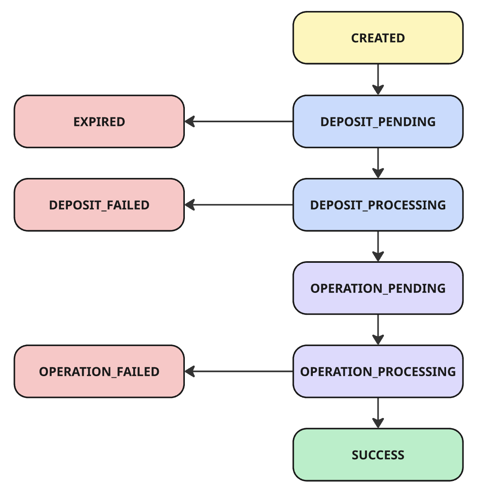
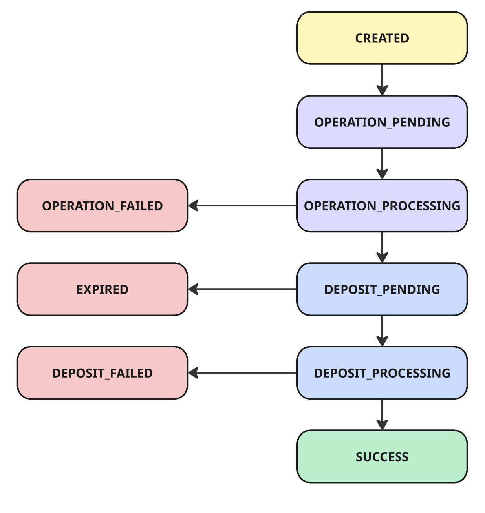
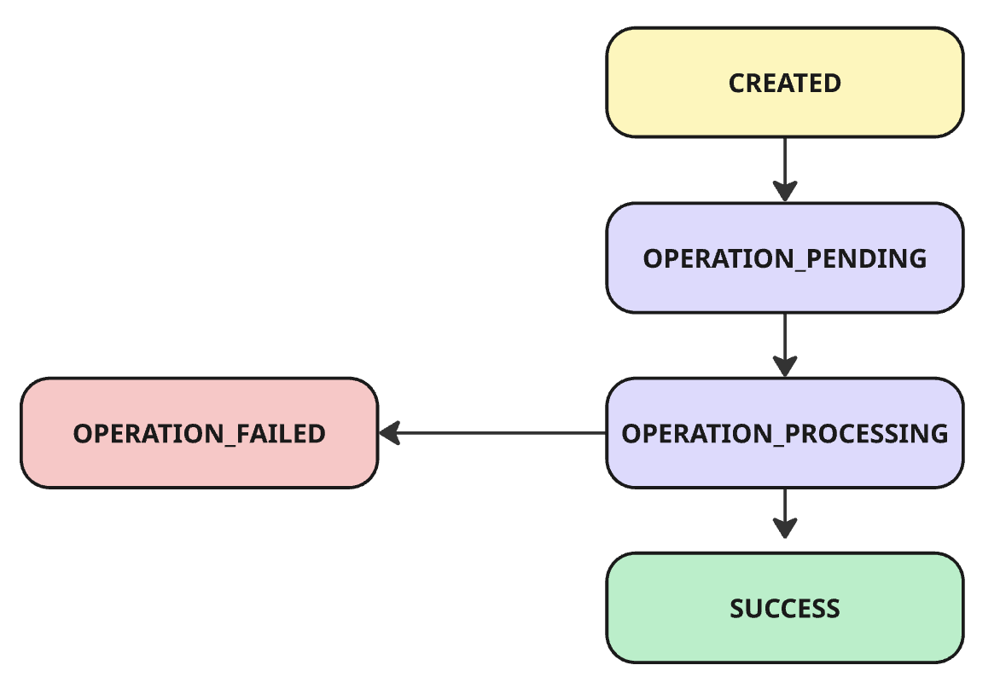

# Execution Lifecycle

An **Execution** represents a state machine that coordinates two independent phases:

1. **Deposit phase** (funds arrival and confirmation)
2. **Operation phase** (transaction execution on the destination chain)

Depending on the usage scenario, these phases may occur in reverse order.

### Core Concepts

* **Execution**: A single user intent being processed.
* **Deposit**: Movement of funds into the system (source → execution environment).
* **Operation**: Action performed using those funds (e.g., swap, lend, trade).

Each execution progresses through a deterministic set of states. Execution state can be [requested](../intents-connect-api-reference/request-an-execution.md) and [monitored](../intents-connect-api-reference/fetch-executions.md) through an API.

## States

### Active States

| Status                 | Description                                                                                        |
| ---------------------- | -------------------------------------------------------------------------------------------------- |
| `CREATED`              | Execution initialised by integrator. Awaiting next step (deposit or operation, depending on flow). |
| `DEPOSIT_PENDING`      | Deposit transaction detected or expected but not yet confirmed.                                    |
| `DEPOSIT_PROCESSING`   | Deposit is being verified and finalised (e.g., confirmations, indexing).                           |
| `OPERATION_PENDING`    | Deposit completed. Operation is queued but not yet submitted.                                      |
| `OPERATION_PROCESSING` | Operation submitted and awaiting confirmation on the destination chain.                            |
| `SUCCESS`              | Execution completed successfully.                                                                  |

### Failure States (Terminal)

|                    |                                                                                                 |
| ------------------ | ----------------------------------------------------------------------------------------------- |
| `EXPIRED`          | The deposit was not completed within the allowed time window.                                   |
| `DEPOSIT_FAILED`   | Deposit failed or was reverted/refunded.                                                        |
| `OPERATION_FAILED` | Operation failed after deposit completion. Recovery actions may be required (e.g., withdrawal). |

### State Machine Invariant

* Execution is **strictly linear within each phase** (deposit → operation or operation → deposit).
* Failure states are **terminal**.
* Only one phase is active at a time.
* Transitions are **event-driven** (deposit acknowledged, on-chain confirmations, backend validations).

## Execution Scenarios

There are different scenarios in which you can use the [API](../intents-connect-api-reference/), each covering a different user flow. Below is a list of the most common scenarios.

State transitions are strictly sequential within each phase; no states are skipped.

### 1. Inbound Execution (Deposit → Operation)

User funds originate from a source chain and are used on the destination chain.

This scenario involves two user actions:

1. Transfer funds into the deposit account.
2. Sign the operation authorisation message.

<figure><figcaption></figcaption></figure>

### 2. Outbound Execution (Operation → Withdraw)

User executes first, then receives funds back to the source.

In outbound flows, the “deposit” phase represents settlement (funds returning to the user), not inbound funding.

This scenario involves a single user's actions:

1. Sign the operation authorisation message.

Note: The transfer into the deposit account must be handled in the signed operation.

<figure><figcaption></figcaption></figure>

### 3. Destination-Only Execution (Operation Only)

No cross-chain movement. Execution happens entirely on the destination chain.

This scenario involves a single user's actions:

1. Sign the operation authorisation message.

<figure><figcaption></figcaption></figure>
