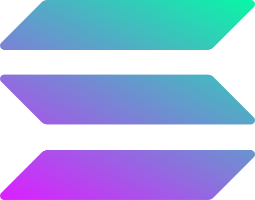

# Supported Chains

Below is a list of blockchains for which Intents Connect can integrate with:

<table data-header-hidden="false" data-header-sticky><thead><tr><th width="60.3046875">‎</th><th>CHAIN</th><th>SOURCE</th><th>DESTINATION</th></tr></thead><tbody><tr><td></td><td>ADI</td><td>✅ Supported</td><td>🗓️ June 2026</td></tr><tr><td></td><td>Arbitrum</td><td>✅ Supported</td><td>✅ Supported</td></tr><tr><td></td><td>Avalanche</td><td>✅ Supported</td><td>🗓️ June 2026</td></tr><tr><td></td><td>Base</td><td>✅ Supported</td><td>✅ Supported</td></tr><tr><td></td><td>Bera</td><td>✅ Supported</td><td>🗓️ June 2026</td></tr><tr><td></td><td>Binance Smart Chain</td><td>✅ Supported</td><td>🗓️ June 2026</td></tr><tr><td></td><td>Ethereum</td><td>✅ Supported</td><td>✅ Supported</td></tr><tr><td></td><td>Gnosis</td><td>✅ Supported</td><td>🗓️ June 2026</td></tr><tr><td></td><td>Monad</td><td>✅ Supported</td><td>🗓️ June 2026</td></tr><tr><td></td><td>Optimism</td><td>✅ Supported</td><td>🗓️ June 2026</td></tr><tr><td></td><td>Plasma</td><td>✅ Supported</td><td>🗓️ June 2026</td></tr><tr><td></td><td>Polygon</td><td>✅ Supported</td><td>🗓️ June 2026</td></tr><tr><td></td><td>Scroll</td><td>✅ Supported</td><td>🗓️ June 2026</td></tr><tr><td></td><td>Solana</td><td>✅ Supported</td><td>🗓️ June 2026</td></tr><tr><td></td><td>XLayer</td><td>✅ Supported</td><td>🗓️ June 2026</td></tr><tr><td></td><td>Stellar</td><td>🗓️ May 2026</td><td>🔜 Coming soon</td></tr><tr><td></td><td>TON</td><td>🗓️ May 2026</td><td>🔜 Coming soon</td></tr></tbody></table>
