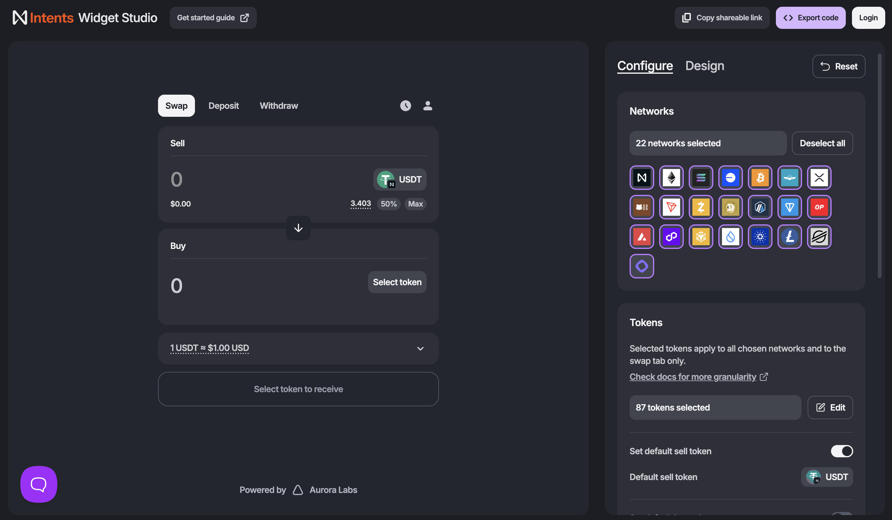

# What is Swap Widget?

The **Intents Swap Widget** lets you integrate a fully functional, cross-chain swap interface into your application in just a few lines of code.

<figure><figcaption></figcaption></figure>

## Features

### Networks

Select which blockchains are available in the widget.

* Supports multiple chains for cross-chain swaps
* Enable or disable networks with one click
* Network selection directly impacts routing and liquidity

Use this to focus the widget on specific ecosystems or supported chains.

### Tokens

Control which tokens users can trade.

* Define a shared token list across all selected networks
* Set a default sell token (e.g. USDT)
* Restrict tokens to simplify UX or guide usage

### Wallet Connection

Choose how users connect wallets.

* Standalone: built-in wallet support, works out of the box
* Dapp: uses your existing wallet connection

Use Standalone for simplicity, Dapp for full control.

### Fee Collection

Earn fees from swaps.

* Enable custom fees on top of protocol fees
* Configure per API key
* Automatically applied to each transaction

### Design

Styl&#x65;**:** Customise the visual appearance.

* Clean or Bold themes
* Adjustable colours (accent, background, states)

Layou&#x74;**:** Adjust structure and spacing.

* Corner radius options
* Toggle container wrapper

### Embedding

#### iFrame

* One-line integration using a generated link
* Works in any app, no framework required

#### React SDK

* Full control via code
* Configure behaviour, wallets, and UI dynamically

### API Keys

Manage widget instances and settings.

* Each key controls configuration and fees
* Create multiple keys for different use cases
* Safe to rotate or revoke

### Reports

Export and analyse usage.

* Download transaction history as CSV
* Filter by date range
* Track volume and fee revenue

## Next Steps



### Create API key

First, create an account and set up [api-keys-and-fees.md](api-keys-and-fees.md "mention") for your integration.



### Integrate the widget

Go to [widget-integration.md](widget-integration.md "mention") page.



