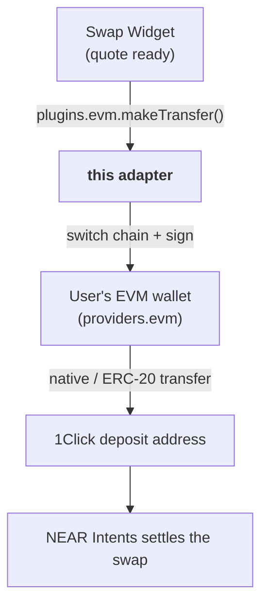

# @aurora-is-near/intents-swap-widget-evm

<a href="https://www.npmjs.com/package/@aurora-is-near/intents-swap-widget-evm"></a>

**EVM chain adapter** for the [Intents Swap Widget](https://github.com/aurora-is-near/intents-swap-widget/tree/main/packages/intents-swap-widget). It lets users swap **from** EVM wallets (MetaMask, Rabby, WalletConnect, …) by sending the deposit transaction on the source chain.

## Do I need it?

| Your setup | Install this? |
|---|---|
| [`intents-swap-widget-standalone`](https://github.com/aurora-is-near/intents-swap-widget/tree/main/packages/intents-swap-widget-standalone) | ❌ No, it is already included |
| [`intents-swap-widget`](https://github.com/aurora-is-near/intents-swap-widget/tree/main/packages/intents-swap-widget) + your own EVM wallet connection | ✅ Yes |
| Users only **receive** on EVM chains | ❌ No, destinations don't need an adapter |

Without it, EVM swaps fail with *"EVM transfers are not supported. Add the EVM plugin from @aurora-is-near/intents-swap-widget-evm …"*. Without `providers.evm`, they fail with *"… Add an EVM provider …"*.

## Where it fits



## Usage

```bash
npm install @aurora-is-near/intents-swap-widget @aurora-is-near/intents-swap-widget-evm
```

```tsx
import '@aurora-is-near/intents-swap-widget/styles.css';

import { Widget, WidgetConfigProvider } from '@aurora-is-near/intents-swap-widget';
import { evm } from '@aurora-is-near/intents-swap-widget-evm';

const { address, connect, disconnect } = useYourEvmWallet(); // wagmi, AppKit, Privy, …

<WidgetConfigProvider
  config={{
    apiKey: 'YOUR_STUDIO_API_KEY', // https://studio.aurora.dev
    connectedWallets: { default: address },
    providers: { evm: window.ethereum },
    plugins: { evm },
    onWalletSignin: connect,
    onWalletSignout: disconnect,
  }}>
  <Widget />
</WidgetConfigProvider>;
```

### `providers.evm`

| Accepted value | Example |
|---|---|
| Any [EIP-1193](https://eips.ethereum.org/EIPS/eip-1193) provider | `window.ethereum`, `await connector.getProvider()` |
| Lazy getter `() => Promise<EIP1193Provider>` | `() => wallet.getEthereumProvider()` |

## What it does

| Step | Behaviour |
|---|---|
| 1. Chain | Calls `wallet_switchEthereumChain` if the wallet is on a different chain. Fails with a clear error if the wallet doesn't know the chain (code `4902`) |
| 2. Account | Uses the wallet's first address, and requests access if needed |
| 3a. Native token | Sends `value` directly to the deposit address |
| 3b. ERC-20 | Calls `transfer(depositAddress, amount)` on the token contract |
| 3c. Aurora (NEAR virtual chain) | Calls `withdrawToNear()` on the token, which bridges the funds straight into NEAR Intents |
| 4. Result | Returns `{ hash }`. The widget then tracks the swap status |

## Supported source chains

Ethereum `eth` · Base `base` · Arbitrum `arb` · BNB Chain `bsc` · Polygon `pol` · Optimism `op` · Avalanche `avax` · Gnosis `gnosis` · Berachain `bera` · Monad `monad` · ADI `adi` · Plasma `plasma` · Scroll `scroll` · X Layer `xlayer` · Aurora `aurora`

Live list with source/destination support: 📖 [Supported chains](https://docs.intents.aurora.dev/intents-swap/supported-chains)

## Exports

| Export | Type | Use |
|---|---|---|
| `evm` | `EvmNetworkPlugin` | Pass it as `plugins.evm` |
| `makeTransfer(args, { provider })` | `Promise<{ hash }>` | The same logic, callable directly (e.g. inside a custom `makeTransfer` widget prop) |
| `MakeTransferOptions` | type | `{ provider: EvmProvider }` |

Dependencies: `viem`, `ethers`. Peer: `@aurora-is-near/intents-swap-widget`.

## Related

| | |
|---|---|
| 🧩 [Core widget README](https://github.com/aurora-is-near/intents-swap-widget/tree/main/packages/intents-swap-widget) | Config, events, theming, how swaps work |
| 🔌 Other adapters | [Solana](https://github.com/aurora-is-near/intents-swap-widget/tree/main/packages/intents-swap-widget-solana) · [Stellar](https://github.com/aurora-is-near/intents-swap-widget/tree/main/packages/intents-swap-widget-stellar) · NEAR is built into the core |
| 🗂 [Monorepo README](https://github.com/aurora-is-near/intents-swap-widget#readme) | All packages |
| 👛 [Wallet Connection docs](https://docs.intents.aurora.dev/intents-swap/widget-configuration/wallet-connection) | Multi-chain and Privy examples |
| 🤖 [`llms.txt`](https://docs.intents.aurora.dev/llms.txt) | Machine-readable docs index |

## License

MIT
