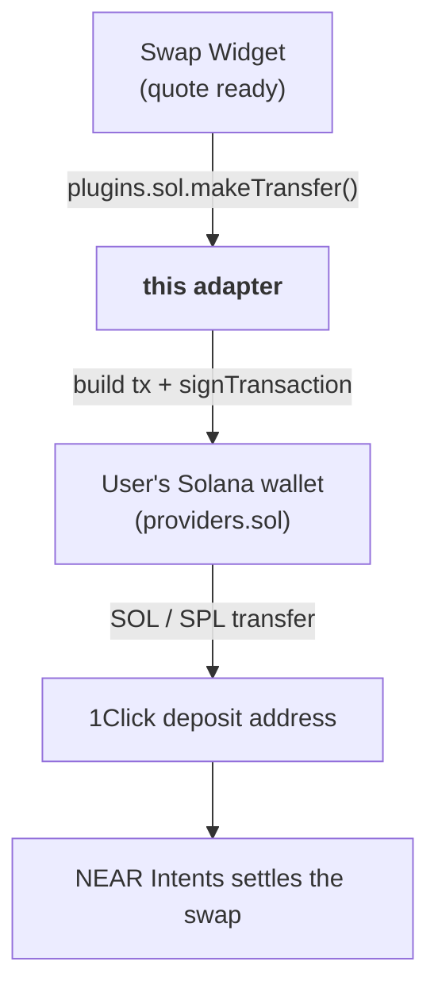

# @aurora-is-near/intents-swap-widget-solana

<a href="https://www.npmjs.com/package/@aurora-is-near/intents-swap-widget-solana"></a>

**Solana chain adapter** for the [Intents Swap Widget](https://github.com/aurora-is-near/intents-swap-widget/tree/main/packages/intents-swap-widget). It lets users swap **from** Solana wallets (Phantom, Solflare, Privy, …) by sending the SOL or SPL-token deposit transaction.

## Do I need it?

| Your setup | Install this? |
|---|---|
| [`intents-swap-widget-standalone`](https://github.com/aurora-is-near/intents-swap-widget/tree/main/packages/intents-swap-widget-standalone) | ❌ No, it is already included |
| [`intents-swap-widget`](https://github.com/aurora-is-near/intents-swap-widget/tree/main/packages/intents-swap-widget) + your own Solana wallet connection | ✅ Yes |
| Users only **receive** on Solana | ❌ No, destinations don't need an adapter |

Without it, Solana swaps fail with *"Solana transfers are not supported. Add the Solana plugin from @aurora-is-near/intents-swap-widget-solana …"*. Without `providers.sol`, they fail with *"… Add a Solana provider …"*.

## Where it fits



## Usage

```bash
npm install @aurora-is-near/intents-swap-widget @aurora-is-near/intents-swap-widget-solana
```

```tsx
import '@aurora-is-near/intents-swap-widget/styles.css';

import { Widget, WidgetConfigProvider } from '@aurora-is-near/intents-swap-widget';
import { sol } from '@aurora-is-near/intents-swap-widget-solana';

const { publicKey, signMessage, signTransaction, connect, disconnect } =
  useYourSolanaWallet(); // e.g. @solana/wallet-adapter-react

<WidgetConfigProvider
  config={{
    apiKey: 'YOUR_STUDIO_API_KEY', // https://studio.aurora.dev
    alchemyApiKey: 'YOUR_ALCHEMY_KEY', // recommended in production, see RPC below
    connectedWallets: { default: publicKey?.toBase58() },
    providers: { sol: { publicKey, signMessage, signTransaction } },
    plugins: { sol },
    onWalletSignin: connect,
    onWalletSignout: disconnect,
  }}>
  <Widget />
</WidgetConfigProvider>;
```

### `providers.sol`

| Field | Type |
|---|---|
| `publicKey` | `PublicKey` (anything with `toString()`) |
| `signMessage` | `(message: Uint8Array) => Promise<Uint8Array>` |
| `signTransaction` | `(tx: Transaction) => Promise<Transaction>` |

Using **Privy**? Its wallet API has a different shape, so it needs a small adapter: 📖 [Privy example](https://docs.intents.aurora.dev/intents-swap/widget-configuration/wallet-connection).

## What it does

| Step | Behaviour |
|---|---|
| Native SOL | `SystemProgram.transfer` to the deposit address |
| SPL token | `transfer` between associated token accounts. **Creates the recipient ATA** first if it doesn't exist |
| Signing | Builds the tx with a fresh blockhash, `signTransaction` via the wallet, then `sendRawTransaction` (preflight on, 3 retries) |
| Result | Returns `{ hash }` (the signature). The widget then tracks the swap status |

### RPC

| Config | RPC used for transfers |
|---|---|
| `alchemyApiKey` set | `https://solana-mainnet.g.alchemy.com/v2/<key>` |
| Not set | `https://solana-rpc.publicnode.com` (public and rate-limited) |

## Exports

| Export | Type | Use |
|---|---|---|
| `sol` | `SolanaNetworkPlugin` | Pass it as `plugins.sol` |
| `makeTransfer(args, options)` | `Promise<{ hash }>` | The same logic, callable directly |
| `MakeTransferOptions` | type | `{ provider: SolanaProvider; rpcUrl?: string; alchemyApiKey?: string }` |

Dependencies: `@solana/web3.js`, `@solana/spl-token`. Peer: `@aurora-is-near/intents-swap-widget`.

## Related

| | |
|---|---|
| 🧩 [Core widget README](https://github.com/aurora-is-near/intents-swap-widget/tree/main/packages/intents-swap-widget) | Config, events, theming, how swaps work |
| 🔌 Other adapters | [EVM](https://github.com/aurora-is-near/intents-swap-widget/tree/main/packages/intents-swap-widget-evm) · [Stellar](https://github.com/aurora-is-near/intents-swap-widget/tree/main/packages/intents-swap-widget-stellar) · NEAR is built into the core |
| 🗂 [Monorepo README](https://github.com/aurora-is-near/intents-swap-widget#readme) | All packages |
| 📖 [Supported chains](https://docs.intents.aurora.dev/intents-swap/supported-chains) | Everything you can swap to and from |
| 🤖 [`llms.txt`](https://docs.intents.aurora.dev/llms.txt) | Machine-readable docs index |

## License

MIT
