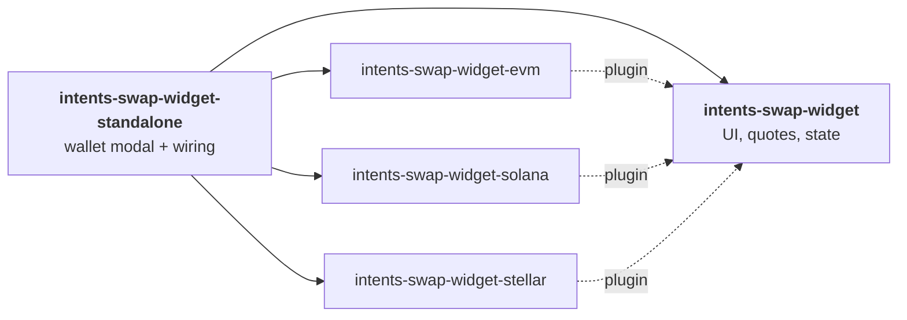

# @aurora-is-near/intents-swap-widget-standalone

<a href="https://www.npmjs.com/package/@aurora-is-near/intents-swap-widget-standalone"></a>
<a href="https://studio.aurora.dev/"></a>

The [Intents Swap Widget](https://github.com/aurora-is-near/intents-swap-widget/tree/main/packages/intents-swap-widget) **with wallet connection built in**. This is the fastest way to add cross-chain swaps to a React app: no wallet libraries, provider setup or connect button needed.

> [!TIP]
> Your app **already connects wallets**, or you need **TON**? Use the core [`@aurora-is-near/intents-swap-widget`](https://github.com/aurora-is-near/intents-swap-widget/tree/main/packages/intents-swap-widget) with the [chain adapters](#how-it-relates-to-the-other-packages) instead.

## Quick start

**1.** Get an API key in **[Widget Studio](https://studio.aurora.dev/)**. You can also design your widget there and copy a ready-made snippet.

**2.** Install:

```bash
npm install @aurora-is-near/intents-swap-widget-standalone
```

**3.** Render:

```tsx
import '@aurora-is-near/intents-swap-widget/styles.css'; // installed as a dependency

import {
  Widget,
  WidgetConfigProvider,
} from '@aurora-is-near/intents-swap-widget-standalone';

export function Swap() {
  return (
    <WidgetConfigProvider config={{ apiKey: 'YOUR_STUDIO_API_KEY' }}>
      <Widget />
    </WidgetConfigProvider>
  );
}
```

The widget now renders its own **Connect wallet** button and a profile button for connecting and disconnecting.

## What's included

| Wallet family | Connected via | Wallets |
|---|---|---|
| **EVM** | [Reown AppKit](https://docs.reown.com/appkit/overview) | MetaMask, Coinbase, Trust and 50+ via WalletConnect |
| **Solana** | Reown AppKit | Phantom, Solflare, WalletConnect |
| **NEAR** | [NEAR Connect](https://www.npmjs.com/package/@hot-labs/near-connect) | HOT, Meteor, MyNearWallet, NEAR Mobile, … |
| **Stellar** | [Stellar Wallets Kit](https://stellarwalletskit.dev/) | Freighter, xBull, … |

**EVM networks in the wallet modal:** Ethereum, Arbitrum, Base, BSC, Polygon, Optimism, Avalanche, Gnosis, Berachain, Monad, Plasma, Scroll, X Layer, ADI, Aurora.

Users can still swap **to** any [supported chain](https://docs.intents.aurora.dev/intents-swap/supported-chains), including chains they have no wallet for.

## How it relates to the other packages



This package **re-exports everything** from the core package. The one difference is `WidgetConfigProvider`, which here connects the wallets and fills these config keys for you:

| Set automatically (don't pass them) | Value |
|---|---|
| `connectedWallets` | Address(es) from the wallet the user connected |
| `providers` | EVM / Solana / Stellar / NEAR signers |
| `plugins` | `evm`, `sol`, `stellar` adapters |
| `onWalletSignin` / `onWalletSignout` | Opens the wallet selector / disconnects |
| `showProfileButton` | `true` |

All other options work the same as in the core package: `apiKey`, `appFees`, allowed tokens and chains, `confidentialMode`, `theme`, `localisation`, …

```tsx
<WidgetConfigProvider
  config={{
    apiKey: 'YOUR_STUDIO_API_KEY',
    allowedChainsList: ['eth', 'base', 'sol', 'near'],
    defaultTargetToken: { symbol: 'USDC', blockchain: 'base' },
    appFees: [{ recipient: 'your-app.near', fee: 20 }],
  }}
  theme={{ colorScheme: 'dark', accentColor: '#bc9cf8', stylePreset: 'bold' }}>
  <Widget />
</WidgetConfigProvider>
```

📖 Full option reference: [Widget Configuration](https://docs.intents.aurora.dev/intents-swap/widget-configuration/get-started) · [Theming](https://docs.intents.aurora.dev/intents-swap/widget-configuration/theming) · [Localisation](https://docs.intents.aurora.dev/intents-swap/widget-configuration/localisation)

## Extra exports

| Export | Use it to |
|---|---|
| `AppKitProvider` | Low-level AppKit context used by the standalone provider |
| `useAppKitWallet()` | Read `{ address, isConnected, isConnecting, connect, disconnect }` of the AppKit (EVM/Solana) connection |
| `useAppKitProviders()` | Get the raw `{ evm, sol }` wallet providers |

## Standalone or core?

| | Standalone (this) | Core + adapters |
|---|:---:|:---:|
| Lines of wallet code | 0 | You write the connect flow |
| TON wallets | ❌ | ✅ |
| Custom wallet modal | ❌ | ✅ |
| Bundle | All chain SDKs | Only adapters you install |

## Troubleshooting

| Symptom | Fix |
|---|---|
| Duplicate `@reown/*`, `@solana/*` or `valtio` versions | Pin them with `resolutions` / `overrides` ([list](https://docs.intents.aurora.dev/intents-swap/widget-configuration/troubleshooting)) |
| `connectedWallets` I passed is ignored | Expected: standalone uses its own connection. Use the core package for that |
| No styles | Import `@aurora-is-near/intents-swap-widget/styles.css`, and wrap your CSS reset in `@layer base` |

## Links

| | |
|---|---|
| 🧩 [Core widget README](https://github.com/aurora-is-near/intents-swap-widget/tree/main/packages/intents-swap-widget) | Config, events, theming, subpath exports, how swaps work |
| 🗂 [Monorepo README](https://github.com/aurora-is-near/intents-swap-widget#readme) | All packages and development |
| 👛 [Wallet Connection docs](https://docs.intents.aurora.dev/intents-swap/widget-configuration/wallet-connection) | Built-in vs external wallets |
| 🛠 [Widget Studio](https://studio.aurora.dev/) | API key, fees, visual config, embed code |
| 🤖 [`llms.txt`](https://docs.intents.aurora.dev/llms.txt) | Machine-readable docs index |

## License

MIT
