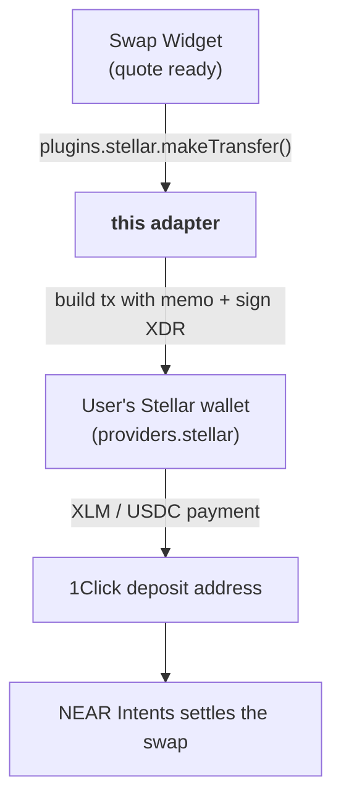

# @aurora-is-near/intents-swap-widget-stellar

<a href="https://www.npmjs.com/package/@aurora-is-near/intents-swap-widget-stellar"></a>

**Stellar chain adapter** for the [Intents Swap Widget](https://github.com/aurora-is-near/intents-swap-widget/tree/main/packages/intents-swap-widget). It lets users swap **from** Stellar wallets (Freighter, xBull, Stellar Wallets Kit, …) by sending XLM or USDC to the deposit address, and it loads their Stellar balances.

## Do I need it?

| Your setup | Install this? |
|---|---|
| [`intents-swap-widget-standalone`](https://github.com/aurora-is-near/intents-swap-widget/tree/main/packages/intents-swap-widget-standalone) | ❌ No, it is already included |
| [`intents-swap-widget`](https://github.com/aurora-is-near/intents-swap-widget/tree/main/packages/intents-swap-widget) + your own Stellar wallet connection | ✅ Yes |
| Users only **receive** on Stellar | ❌ No, destinations don't need an adapter |

Without it, Stellar swaps fail with *"Stellar transfers are not supported. Add the Stellar plugin from @aurora-is-near/intents-swap-widget-stellar …"*. Without `providers.stellar`, they fail with *"… Add a Stellar provider …"*.

## Where it fits



## Usage

```bash
npm install @aurora-is-near/intents-swap-widget @aurora-is-near/intents-swap-widget-stellar
```

```tsx
import '@aurora-is-near/intents-swap-widget/styles.css';

import { Widget, WidgetConfigProvider } from '@aurora-is-near/intents-swap-widget';
import { stellar } from '@aurora-is-near/intents-swap-widget-stellar';

const wallet = useYourStellarWallet(); // e.g. Stellar Wallets Kit

<WidgetConfigProvider
  config={{
    apiKey: 'YOUR_STUDIO_API_KEY', // https://studio.aurora.dev
    connectedWallets: { default: wallet.address },
    providers: {
      stellar: {
        publicKey: wallet.address, // G… address
        signMessage: wallet.signMessage,
        signTransaction: wallet.signTransaction,
      },
    },
    plugins: { stellar },
    onWalletSignin: wallet.connect,
    onWalletSignout: wallet.disconnect,
  }}>
  <Widget />
</WidgetConfigProvider>;
```

### `providers.stellar`

| Field | Type |
|---|---|
| `publicKey` | `string` (G… address) |
| `signMessage` | `(message: string) => Promise<{ signedMessage, signerAddress }>` |
| `signTransaction` | `(xdr: string, opts?: { networkPassphrase, address }) => Promise<string \| { signedTxXdr }>` |

Both the Stellar Wallets Kit signature (2 args) and the single-argument Freighter API work. The adapter detects which one it gets and falls back automatically.

## What it does

| Capability | Behaviour |
|---|---|
| `makeTransfer` | Builds a Stellar **mainnet** payment of **XLM** or **USDC** (Circle) with the **memo** from the quote. The memo is required, and the adapter handles text, ID and hash formats. The wallet signs it, then the adapter submits it |
| `getNativeBalances` | Reads XLM and USDC (trustline) balances straight from Soroban RPC |
| `decodePublicKey` | Converts the G… address to raw bytes. The widget uses this to derive the user's Intents account |
| RPC | Tries `sorobanrpc.stellar.org`, then Ankr, then Nodies |

## Exports

| Export | Type | Use |
|---|---|---|
| `stellar` | `StellarNetworkPlugin` | Pass it as `plugins.stellar` |
| `makeTransfer(args, { provider })` | `Promise<{ hash }>` | The transfer logic, callable directly |
| `MakeTransferOptions` | type | `{ provider: StellarProvider }` |

Dependencies: `@stellar/stellar-sdk`, `axios`. Peer: `@aurora-is-near/intents-swap-widget`.

## Related

| | |
|---|---|
| 🧩 [Core widget README](https://github.com/aurora-is-near/intents-swap-widget/tree/main/packages/intents-swap-widget) | Config, events, theming, how swaps work |
| 🔌 Other adapters | [EVM](https://github.com/aurora-is-near/intents-swap-widget/tree/main/packages/intents-swap-widget-evm) · [Solana](https://github.com/aurora-is-near/intents-swap-widget/tree/main/packages/intents-swap-widget-solana) · NEAR is built into the core |
| 🗂 [Monorepo README](https://github.com/aurora-is-near/intents-swap-widget#readme) | All packages |
| 👛 [Wallet Connection docs](https://docs.intents.aurora.dev/intents-swap/widget-configuration/wallet-connection) | Stellar and multi-chain examples |
| 📖 [Supported chains](https://docs.intents.aurora.dev/intents-swap/supported-chains) | Everything you can swap to and from |
| 🤖 [`llms.txt`](https://docs.intents.aurora.dev/llms.txt) | Machine-readable docs index |

## License

MIT
