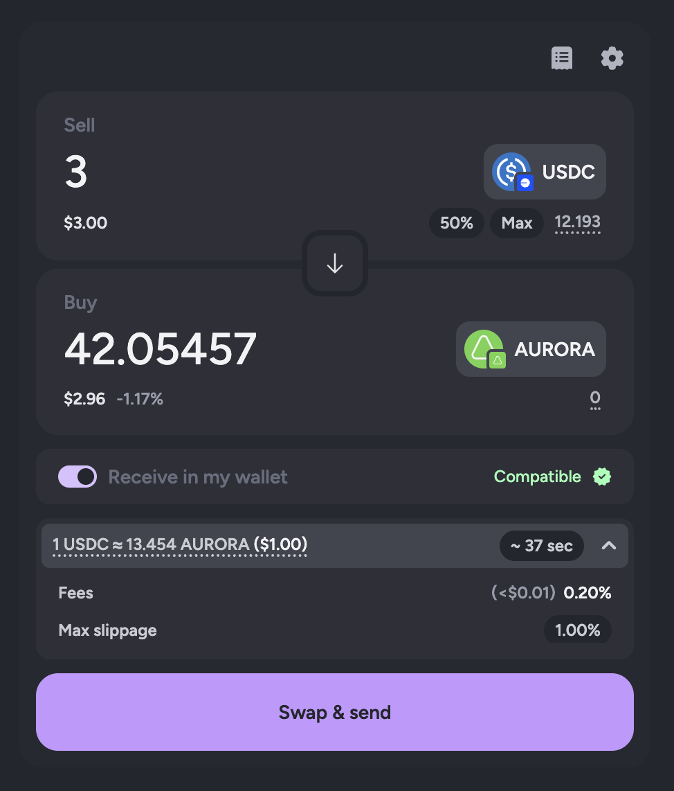
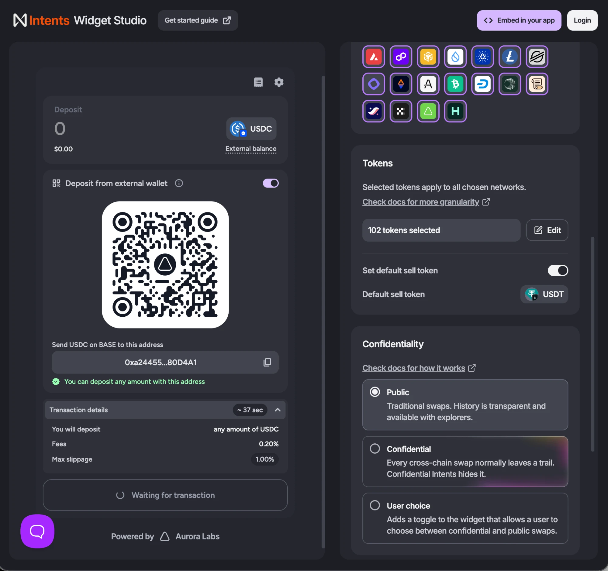
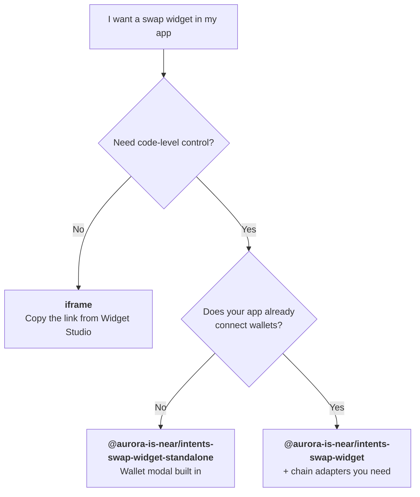
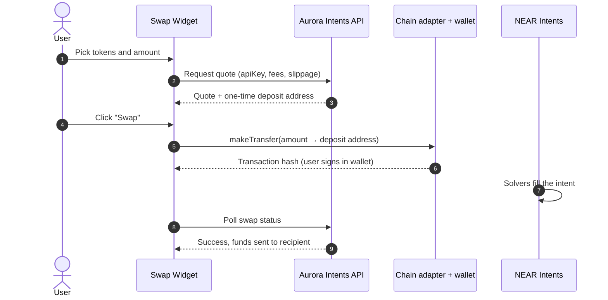

# @aurora-is-near/intents-swap-widget

<p align="center">
  
</p>

<p align="center">
  <a href="https://www.npmjs.com/package/@aurora-is-near/intents-swap-widget"></a>
  <a href="https://studio.aurora.dev/"></a>
  <a href="https://docs.intents.aurora.dev/intents-swap/what-is-swap-widget"></a>
</p>

A React **cross-chain swap widget** powered by [NEAR Intents](https://docs.near-intents.org/). Drop it into your app and let users swap any supported asset across **35+ chains** from a single UI, while you earn fees on every swap.

> [!TIP]
> **Just need a working widget with wallet connection built in?** Use [`@aurora-is-near/intents-swap-widget-standalone`](https://github.com/aurora-is-near/intents-swap-widget/tree/main/packages/intents-swap-widget-standalone). This package (the core) is for apps that **already connect wallets** and want full control.

## Contents

- [At a glance](#at-a-glance)
- [Widget Studio](#widget-studio)
- [Choose your integration](#choose-your-integration)
- [Quick start](#quick-start)
- [How it works](#how-it-works)
- [Wallets and chain adapters](#wallets-and-chain-adapters)
- [Configuration](#configuration)
- [Widgets and events](#widgets-and-events)
- [Theming and localisation](#theming-and-localisation)
- [Subpath exports (build your own UI)](#subpath-exports-build-your-own-ui)
- [Troubleshooting](#troubleshooting)
- [Documentation map](#documentation-map)

## At a glance

| | |
|---|---|
| **What** | A React swap UI plus the hooks, state machine and components behind it |
| **Routing** | NEAR Intents via the Aurora Intents API (1Click-compatible) |
| **Chains** | 35+: EVM chains, Solana, NEAR, Stellar, TON, Bitcoin, Sui, Tron, XRP and more ([full list](https://docs.intents.aurora.dev/intents-swap/supported-chains)) |
| **Assets** | Anything the Intents API lists ([supported assets](https://docs.intents.aurora.dev/intents-swap/supported-assets)) |
| **Requires** | React `>=18.2`, an **API key** from [Widget Studio](https://studio.aurora.dev/) |
| **Wallets** | You bring them: pass addresses and providers in (see [Wallets](#wallets-and-chain-adapters)) |
| **Fees** | Set per API key in Studio, or per swap with `appFees` |
| **Privacy** | Optional [confidential swaps](https://docs.intents.aurora.dev/intents-swap/confidential-swaps) (`confidentialMode`) |

## Widget Studio

**[Widget Studio](https://studio.aurora.dev/)** is a no-code dashboard for the widget. Use it to:

- 🔑 **Get your API key.** It is required, and it is also where your fees are configured.
- 🌐 **Pick networks and tokens**, set default sell/buy tokens, and choose confidentiality mode.
- 🎨 **Design it**: Clean or Bold style, accent and background colours, corner radius, container.
- 👀 **Preview it live** before shipping.
- 📦 **Embed it**: **Embed in your app** gives you an **iframe link** or a ready-to-paste **React snippet**.
- 📊 **Download reports** of swaps made with your API keys (CSV).

<p align="center">
  
</p>

> [!NOTE]
> The API key is **not secret**. It is safe to ship in front-end code.

## Choose your integration



| | iframe | Standalone package | Core package (this one) |
|---|:---:|:---:|:---:|
| Setup effort | 1 line | ~5 lines | Moderate |
| Wallet connection | Built in | Built in (AppKit, NEAR Connect, Stellar Wallets Kit) | **Yours** |
| TON wallets | – | ❌ | ✅ |
| Hooks and events (`onMsg`) | ❌ | ✅ | ✅ |
| Custom transfers (`makeTransfer`) | ❌ | ✅ | ✅ |
| Bundle size control | – | All chain SDKs included | Only adapters you install |

## Quick start

**1. Install** the core package and the [adapter](#wallets-and-chain-adapters) for each chain family your wallets support:

```bash
npm install @aurora-is-near/intents-swap-widget
# Add only what you need:
npm install @aurora-is-near/intents-swap-widget-evm      # Ethereum, Base, Arbitrum, …
npm install @aurora-is-near/intents-swap-widget-solana   # Solana
npm install @aurora-is-near/intents-swap-widget-stellar  # Stellar
```

**2. Render** the widget inside `WidgetConfigProvider`:

```tsx
import '@aurora-is-near/intents-swap-widget/styles.css';

import {
  Widget,
  WidgetConfigProvider,
} from '@aurora-is-near/intents-swap-widget';
import { evm } from '@aurora-is-near/intents-swap-widget-evm';

export function Swap() {
  const { address, connect, disconnect } = useYourEvmWallet(); // your wallet lib

  return (
    <WidgetConfigProvider
      config={{
        apiKey: 'YOUR_STUDIO_API_KEY',
        connectedWallets: { default: address },
        providers: { evm: window.ethereum }, // any EIP-1193 provider
        plugins: { evm },
        onWalletSignin: connect,
        onWalletSignout: disconnect,
      }}
      theme={{ colorScheme: 'dark', accentColor: '#bc9cf8' }}>
      <Widget />
    </WidgetConfigProvider>
  );
}
```

That's a working swap widget. Next: [add more chains](#wallets-and-chain-adapters), [restrict tokens](#configuration), or [match your brand](#theming-and-localisation).

## How it works

The widget never holds user funds. Each swap is a **quote → deposit → settle** flow:



The chain adapter (`plugins.evm`, `plugins.sol`, …) only handles **step 5**: sending funds from the user's wallet to the deposit address on the source chain. The rest is shared by all chains.

## Wallets and chain adapters

The core package does not bundle chain SDKs. You pass three things for each chain family:

| Config key | What it is |
|---|---|
| `connectedWallets` | Addresses keyed by chain, e.g. `{ default: '0x…', sol: '…', ton: 'UQ…' }`. The widget uses the selected token's chain, falling back to `default`. |
| `providers` | Signers the widget uses: `evm`, `sol`, `stellar`, `near` |
| `plugins` | Adapter per chain family that performs the deposit transfer |

| Source chain family | Adapter package | `plugins` key | `providers` value |
|---|---|---|---|
| **EVM** (Ethereum, Base, Arbitrum, BSC, Polygon, Optimism, Avalanche, Aurora, …) | [`intents-swap-widget-evm`](https://github.com/aurora-is-near/intents-swap-widget/tree/main/packages/intents-swap-widget-evm) | `evm` | EIP-1193 provider, or `() => Promise<provider>` |
| **Solana** | [`intents-swap-widget-solana`](https://github.com/aurora-is-near/intents-swap-widget/tree/main/packages/intents-swap-widget-solana) | `sol` | `{ publicKey, signMessage, signTransaction }` |
| **Stellar** | [`intents-swap-widget-stellar`](https://github.com/aurora-is-near/intents-swap-widget/tree/main/packages/intents-swap-widget-stellar) | `stellar` | `{ publicKey, signMessage, signTransaction }` |
| **NEAR** | Built in, no adapter needed | – | `() => nearWallet` |
| **TON and others** | None: pass your own [`makeTransfer`](#custom-transfers) to the widget | – | – |

Any supported chain can be a **destination**, whether or not the user has a wallet for it. With `allowSwapWithExternalWallet`, users can also deposit from any chain by sending to a QR-code address.

<details>
<summary><b>Multi-chain example</b> (EVM + Solana + Stellar + NEAR + TON)</summary>

```tsx
import { evm } from '@aurora-is-near/intents-swap-widget-evm';
import { sol } from '@aurora-is-near/intents-swap-widget-solana';
import { stellar } from '@aurora-is-near/intents-swap-widget-stellar';

const config = {
  apiKey: 'YOUR_STUDIO_API_KEY',
  connectedWallets: {
    default: evmAddress,
    sol: solanaAddress,
    stellar: stellarAddress,
    near: nearAccountId,
    ton: tonAddress,
  },
  providers: {
    evm: window.ethereum,
    sol: { publicKey, signMessage, signTransaction },
    stellar: { publicKey: stellarAddress, signMessage, signTransaction },
    near: () => nearWallet,
  },
  plugins: { evm, sol, stellar },
  onWalletSignin: openWalletModal,
  onWalletSignout: disconnect,
};
```

</details>

Adapter guides for Privy, NEAR and TON: 📖 [Wallet Connection docs](https://docs.intents.aurora.dev/intents-swap/widget-configuration/wallet-connection).

## Configuration

Everything goes through the `config` prop of `WidgetConfigProvider`. Other props: `theme`, `localisation`, `rpcs`, `balanceViaRpc`. These are the options most integrations use:

| Option | Type | Purpose |
|---|---|---|
| `apiKey` | `string` | **Required.** Your key from [Widget Studio](https://studio.aurora.dev/) |
| `appFees` | `{ recipient, fee }[]` | Extra fees in basis points, sent to a NEAR Intents account |
| `allowedTokensList` | `string[]` | Only allow these tokens (asset IDs or symbols) on both sides |
| `allowedSourceTokensList` / `allowedTargetTokensList` | `string[]` | Same, for one side only |
| `allowedChainsList` | `Chains[]` | Only allow these chains, e.g. `['eth', 'base', 'sol']` |
| `defaultSourceToken` / `defaultTargetToken` | token or `null` | Preselected tokens |
| `slippageTolerance` | `number` | In bps: `100` = 1% |
| `sendAddress` | `string` | Fixed recipient (defaults to the sender's address) |
| `confidentialMode` | `'public' \| 'confidential' \| 'user-choice'` | [Confidential swaps](https://docs.intents.aurora.dev/intents-swap/confidential-swaps) |
| `allowSwapWithExternalWallet` | `boolean` | Adds a QR-code deposit option for any chain |
| `alchemyApiKey` | `string` | More reliable balances and Solana RPC (recommended in production) |
| `tonCenterApiKey` | `string` | TON balances |
| `fetchQuote` | `fn` | Proxy quotes through your own backend |

```tsx
<WidgetConfigProvider
  config={{
    apiKey: 'YOUR_STUDIO_API_KEY',
    allowedChainsList: ['eth', 'base', 'arb', 'sol', 'near'],
    allowedTokensList: ['USDC', 'USDT', 'ETH', 'SOL'],
    appFees: [{ recipient: 'your-app.near', fee: 20 }], // 0.2%
    slippageTolerance: 50, // 0.5%
  }}>
  <Widget />
</WidgetConfigProvider>
```

📖 **Full reference (40+ options):** [Widget Configuration docs](https://docs.intents.aurora.dev/intents-swap/widget-configuration/get-started). An in-repo copy lives at [`docs/configuration.md`](https://github.com/aurora-is-near/intents-swap-widget/blob/main/docs/configuration.md), and the `WidgetConfig` type is in [`src/types/config.ts`](https://github.com/aurora-is-near/intents-swap-widget/blob/main/packages/intents-swap-widget/src/types/config.ts). `yarn check-docs` keeps the doc and the type in sync.

<details>
<summary><b>Chain IDs</b> used in config (<code>allowedChainsList</code>, <code>connectedWallets</code> keys, …)</summary>

| Family | IDs |
|---|---|
| EVM | `eth` `base` `arb` `bsc` `pol` `op` `avax` `gnosis` `bera` `monad` `adi` `plasma` `scroll` `xlayer` `aurora` |
| Non-EVM | `near` `sol` `stellar` `ton` `btc` `sui` `xrp` `doge` `tron` `zec` `ltc` `cardano` `aleo` `bch` `dash` `starknet` `hypercore` |

Source: [`src/constants/chains.ts`](https://github.com/aurora-is-near/intents-swap-widget/blob/main/packages/intents-swap-widget/src/constants/chains.ts).

</details>

## Widgets and events

| Component | Use it for |
|---|---|
| `Widget` | **The default.** Full widget with settings and history. `defaultMode`: `'swap'` (default) or `'topup'` |
| `WidgetSwap` | Swap form only |
| `WidgetDepositMode` | Top-up form: receive a fixed token, pay from a wallet or an external-wallet QR code |
| `WidgetDeposit` / `WidgetWithdraw` | Moving funds into or out of your app's Intents account (`enableAccountAbstraction`) |

**Events**: listen to the transfer pipeline with `onMsg`:

```tsx
<Widget
  onMsg={(msg) => {
    if (msg.type === 'on_transfer_success') {
      analytics.track('swap', { hash: msg.hash });
    }
  }}
/>
```

<a id="custom-transfers"></a>**Custom transfers**: send the deposit yourself (e.g. for TON) and return the hash:

```tsx
<Widget
  makeTransfer={async (args) => {
    const hash = await sendTon(args.address, args.amount);
    return { hash, transactionLink: `https://tonviewer.com/transaction/${hash}` };
  }}
/>
```

📖 [Widgets docs](https://docs.intents.aurora.dev/intents-swap/widget-configuration/widgets)

## Theming and localisation

| Approach | How | Docs |
|---|---|---|
| **Theme object** (recommended) | `theme={{ colorScheme, accentColor, backgroundColor, stylePreset: 'clean' \| 'bold', borderRadius, showContainer }}` | [Theming](https://docs.intents.aurora.dev/intents-swap/widget-configuration/theming) |
| **CSS variables** | Override `--sw-*` variables. Full list: [`src/theme.css`](https://github.com/aurora-is-near/intents-swap-widget/blob/main/packages/intents-swap-widget/src/theme.css) | [Theming](https://docs.intents.aurora.dev/intents-swap/widget-configuration/theming) |
| **Copy / i18n** | `localisation={{ 'submit.active.swap': 'Swap now' }}`. All keys: [`src/types/localisation.ts`](https://github.com/aurora-is-near/intents-swap-widget/blob/main/packages/intents-swap-widget/src/types/localisation.ts) | [Localisation](https://docs.intents.aurora.dev/intents-swap/widget-configuration/localisation) |

> [!IMPORTANT]
> Always import `@aurora-is-near/intents-swap-widget/styles.css`. If your app has a global CSS reset, wrap it in `@layer base { … }`, otherwise Tailwind layering removes the widget's spacing.

## Subpath exports (build your own UI)

Use the pieces directly if the pre-built widgets don't fit your use case:

| Import | Contains |
|---|---|
| `@aurora-is-near/intents-swap-widget` | Everything below, plus `Widget*` and `WidgetConfigProvider` |
| `…/components` | Stateless UI kit: buttons, inputs, banners |
| `…/features` | Rich components that use widget context (e.g. `SwapQuote`) |
| `…/hooks` | Logic without UI (e.g. `useTokens`) |
| `…/machine` | Finite state machine and store, the core of the business logic |
| `…/types` | Domain types: `Token`, `Chains`, `Quote`, `WidgetConfig`, … |
| `…/ext` | Optional integrations (e.g. `useAlchemyBalanceIntegration`) |
| `…/constants` · `…/utils` · `…/config` | Constants, helpers, config store |
| `…/styles.css` · `…/tailwind.css` · `…/theme.css` | Styles (bundled, Tailwind source, variables only) |

## Troubleshooting

| Symptom | Fix |
|---|---|
| `EVM transfers are not supported. Add the EVM plugin …` (or Solana / Stellar) | Install the adapter and add it to `plugins` |
| `… Add an EVM provider via the providers configuration property` | Pass the wallet signer in `providers` |
| Button says "Connect wallet" and can't be clicked | Provide `onWalletSignin` |
| Balances load forever | Add `alchemyApiKey`. For TON, add `tonCenterApiKey` |
| No styles or broken spacing | Import `styles.css`, and scope your CSS reset with `@layer base` |
| Duplicate dependency errors (`valtio`, `@reown/*`, `@solana/*`) | Pin versions with `resolutions` / `overrides` |

📖 [Troubleshooting docs](https://docs.intents.aurora.dev/intents-swap/widget-configuration/troubleshooting) · [Open an issue](https://github.com/aurora-is-near/intents-swap-widget/issues)

## Documentation map

| Where to go | For |
|---|---|
| [Monorepo README](https://github.com/aurora-is-near/intents-swap-widget#readme) | All packages, development setup, contributing |
| [`-standalone`](https://github.com/aurora-is-near/intents-swap-widget/tree/main/packages/intents-swap-widget-standalone) · [`-evm`](https://github.com/aurora-is-near/intents-swap-widget/tree/main/packages/intents-swap-widget-evm) · [`-solana`](https://github.com/aurora-is-near/intents-swap-widget/tree/main/packages/intents-swap-widget-solana) · [`-stellar`](https://github.com/aurora-is-near/intents-swap-widget/tree/main/packages/intents-swap-widget-stellar) | Wallet-included widget and chain adapters |
| [What is Swap Widget?](https://docs.intents.aurora.dev/intents-swap/what-is-swap-widget) | Product overview |
| [Widget integration](https://docs.intents.aurora.dev/intents-swap/widget-integration) | Studio walkthrough (iframe or React) |
| [API Keys & Fees](https://docs.intents.aurora.dev/getting-started/api-keys-and-fees) | Fee split, limits, reports |
| [Supported chains](https://docs.intents.aurora.dev/intents-swap/supported-chains) · [assets](https://docs.intents.aurora.dev/intents-swap/supported-assets) | What can be swapped |
| [`llms.txt`](https://docs.intents.aurora.dev/llms.txt) | 🤖 Machine-readable index of all docs. Add `.md` to any docs URL to get Markdown |

## License

[MIT](https://github.com/aurora-is-near/intents-swap-widget/blob/main/LICENSE)
